# 总体架构

Transformer主要由Encoders和Decoders两部分组成，假设这里的N=6，则：

- 这里的Encoders由训练得到的6个**结构相同但参数不同**的Encoder组成，Decoders由6个**结构相同但参数不同**的Decoder组成；
- 在训练阶段，最下面的inputs（问题）和Outputs（标准答案）都是一种输入，最后输出是最上面部分的Output （生成答案），再通过损失函数的值进行反向传播去修改模型的参数；
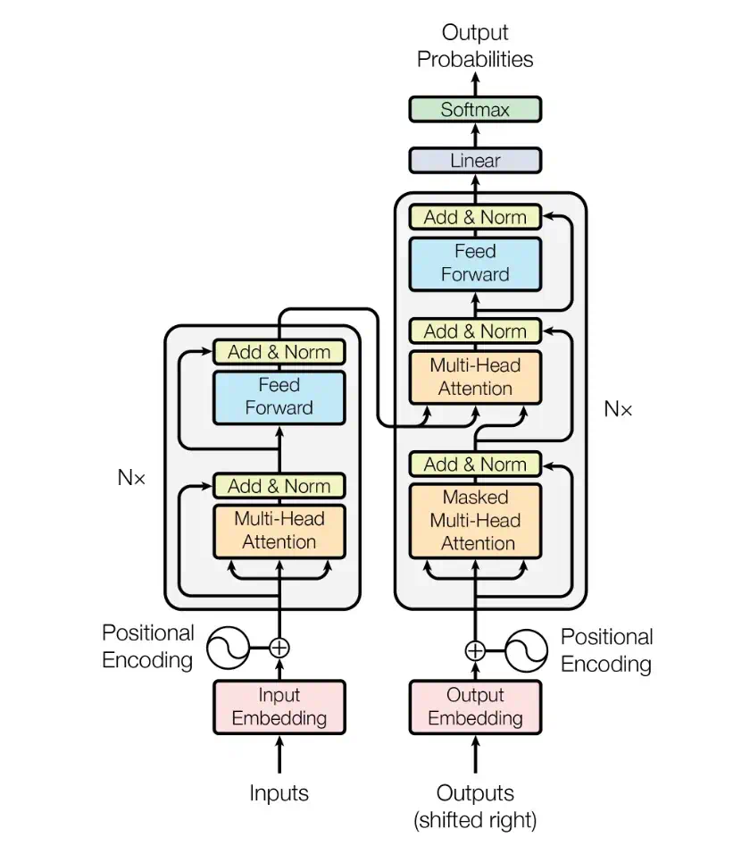

🔄 推理过程详解：

> ✅ Encoder：
>
> - 输入句子如：`["The", "cat", "sleeps"]`
> - Encoder 计算所有层的 KV（Key 和 Value）
> - **这个 KV 仅计算一次，整个推理过程复用**
>
> ✅ Decoder：
>
> - 首先给Decoder输入一个<BOS>表示开始推理
> - 然后利用Encoder生成KV值，生成一个 token（如 `“I”`），追加到 Decoder 的输入序列
> - Decoder 的 **自注意力（self-attention）层** 会构造新的 KV：
>   - Keys 和 Values 会随着生成序列的增加而扩展
>   - 通常使用缓存机制（cache）来高效增量计算
> - Decoder 的 **交叉注意力（encoder-decoder attention）层**：
>   - 使用 Encoder 输出的 **固定 KV**（即 Encoder 的上下文）

Transformer 推理阶段只需一次 Encoder 前向计算，其 KV 不变；Decoder 的 KV 则每步更新（或增量缓存）以生成新 token。

# Encoders 

## 输入部分Embedding

在自然语言处理 (NLP) 任务中，处理文本需要将每个单词转换成对应的数字表示。大多数Embedding方法都归结为**将单词或标记转换为向量**。各种嵌入技术之间的区别在于它们如何处理这种“单词→向量”的转换。以下是嵌入技术的两个主要特性：

- **「语义表示」** 某些类型的Embedding可以捕捉单词之间的语义关系。这意味着，含义更接近的单词在向量空间中更接近。例如，“猫”和“狗”的向量肯定比“狗”和“草莓”的向量更相似。
- **「维度」** 嵌入向量的大小应该是多少？15、50 还是 300？找到合适的平衡点是关键。较小的向量（较低维度）在内存中保存或处理效率更高，而较大的向量（较高维度）可以捕捉复杂的关系，但容易出现过拟合。作为参考，GPT-2 模型系列的嵌入大小至少为 768。
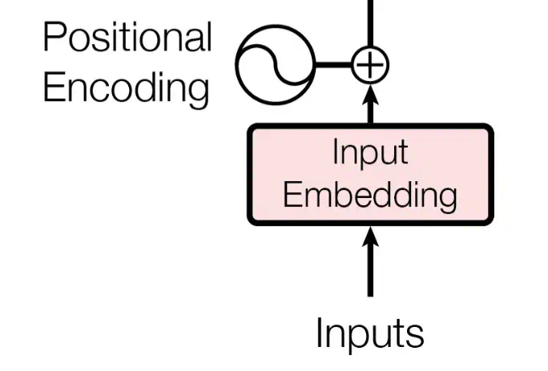

### 词嵌入 Input Embedding

##### 传统Embedding

几乎所有词向量嵌入技术都**依赖于海量文本数据来提取词语之间的关系**。此前，词向量嵌入方法依赖于**基于文本中词语出现频率的统计**方法。这种方法基于这样的假设：如果一对词语经常同时出现，那么它们之间的关系必然更密切。这些方法简单易行，计算量也不大。其中一种比较有代表性方法是TF-IDF。

**TF-IDF(词频-逆文档频率）**:

> TF-IDF 的理念是通过考虑两个因素来计算单词在文档中的重要性：
>
> - **「词频 (TF)」** 词语在文档中出现的频率。TF 值越高，表示词语对文档越重要。
> - **「逆文档频率 (IDF)」** 词语在文档中的稀缺性。这种方法是基于这样的假设：出现在多篇文档中的词语的重要性低于仅出现在少数文档中的词语。

关于这个嵌入向量空间，有两点值得注意：

> - 大多数单词都集中在一个特定的区域。这意味着在这种方法中，大多数单词的嵌入向量都很相似。这表明这些嵌入向量缺乏表达力和独特性。
> - 这些嵌入向量之间没有语义联系。单词之间的距离与它们的含义无关。

由于 TF-IDF 基于文档中单词的出现频率，因此语义上接近的单词（例如数字）在向量空间中没有关联。TF-IDF 和类似统计方法的简单性使得它们在信息检索、关键词提取和基本文本分析等应用中非常有用。

##### 静态Embedding

谷歌在2013年提出的**word2vec**是一种比TF-IDF更先进的技术。顾名思义，它是一个旨在**将单词转换为嵌入向量**的网络。它通过定义一个辅助目标来实现这一点，即优化网络的目标。

例如，**「在CBOW（连续词袋）中，word2vec网络被训练成在给定一个单词的相邻词作为输入时预测该单词」**。其直观理解是，你可以根据该单词周围的单词推断出该单词的嵌入。除了 CBOW 之外，另一种变体是 Skip-gram，其工作原理完全相反：它旨在通过给定特定单词作为输入来预测其邻近单词。

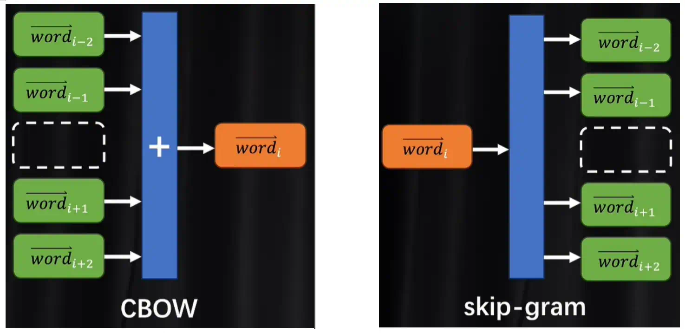

##### **上下文Embedding**

BERT 全称为Bidirectional encoder representations from transformers(基于Transformer的双向编码器表征)，自编码模型（同时从左和从右编码）；在自然语言处理 (NLP) 领域，BERT 无处不在。

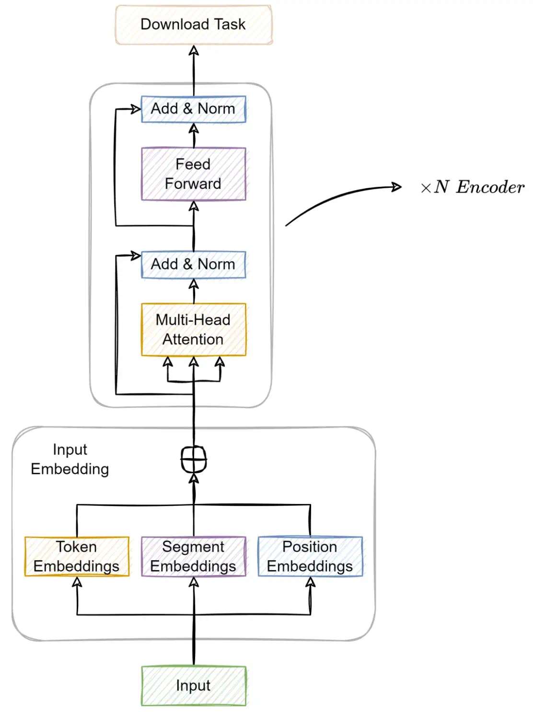

**BERT 是一个仅使用编码器Encoder的 Transformer 模型**，由四个主要部分组成，如上图所示：

> - 分词器 (Tokenizer)：将文本切分为整数序列。
> - 嵌入 (Embedding)：将离散标记转换为向量的模块。
> - 编码器 (Encoder)：一堆带有自注意力机制的 Transformer 模块。
> - 任务头 (Task Head)：当编码器完成表征后，这个特定于任务的头会处理这些表征，以完成标记生成或分类任务。

### 位置嵌入 Positional Encoding

> 由于transformer模型不包含递归和卷积，因此为了让模型利用序列的顺序信息，必须注入一些有关序列中标记的相对或绝对位置的信息。

**1、绝对位置编码**

绝对位置编码只考虑绝对信息 ，可以只对数据进行修饰；transformer模型将 “位置编码” 添加到 encoder 和 decoder 堆栈底部的 input embeddings。位置编码与词嵌入具有相同的维度 $ d_{model} $，因此可以将**两者相加**。transformer模型使用了不同频率的正弦和余弦函数来表示绝对位置编码：
$$
PE_{(pos,2i)}=sin(pos/10000^{2i/d_{model}})
$$

$$
PE_{(pos,2i+1)}=cos(pos/10000^{2i/d_{model}})
$$

 $ i $ 是维度， $ pos $  指词语在序列中的位置，偶数位置，使用正弦编码，奇数位置，使用余弦编码。

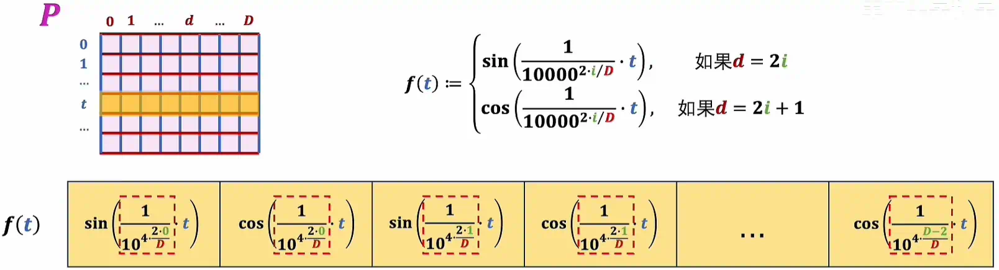

**2、相对位置编码**

相对位置编码需要两个词向量进行比较，只有在**计算注意力得分的A矩阵的过程中**进行修饰；可以用加法，也可以乘法用；

(1)加法

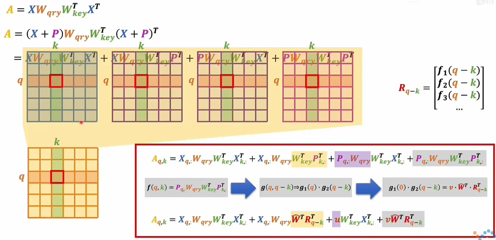

例如，应用在MPT-7B这个大模型上的**Alibi**方法

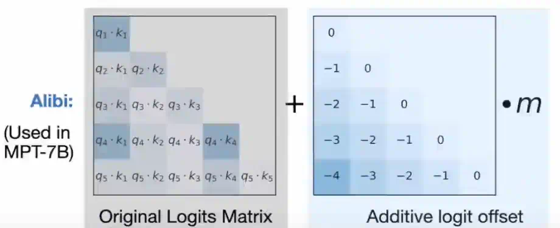

(2) 乘法--旋转位置编码
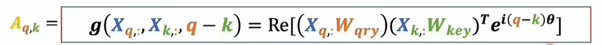

例如，比较典型的方法**RoPE**，应用在LLaMa、LLaMa-2、GPT-J等等大模型上：

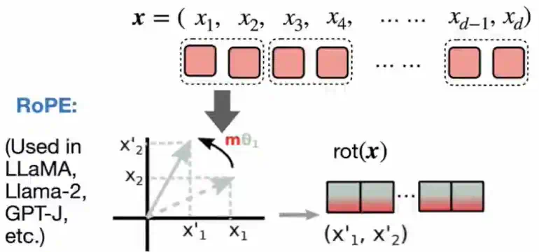

## Attention

> 通过Embedding阶段获取单个词的词义后，还不具备词与词之间的相关语义；还需要Attention机制来进一步分析和理解获取词和词之间组合后的语义，所以输入的是一组词向量； 

注意力函数可以描述为将查询和一组键值对映射到输出，其中查询、键、值和输出都是向量。输出计算为值的加权和，其中分配给每个值的权重由具有相应键的查询的兼容性函数计算。

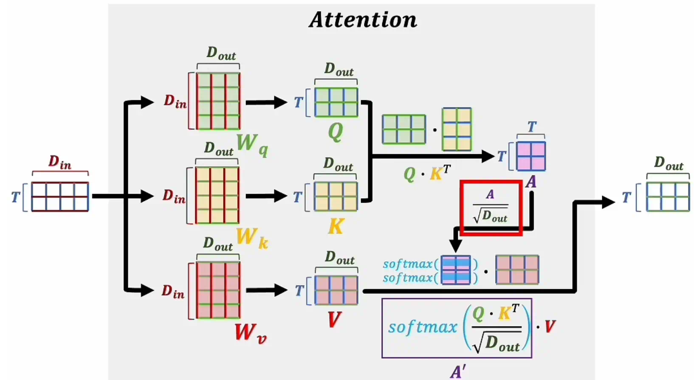

### Scaled Dot-Product Attention缩放点积注意力

$$
Attention(Q,K,V)=softmax(\frac{QK^T}{\sqrt{d_k}})·V
$$
>- Softmax是一种激活函数，它可以将一个数值向量归一化为一个概率分布向量，且各个概率之和为1。在这里逐行进行归一，而不是把整个A矩阵加起来归一；
>
>- 对于$ d_k $值较大，点积的幅度会变大，从而将 softmax 函数推入其梯度极小的区域 。为了抵消这种影响，将点积缩放 $ \frac{1}{\sqrt{d_k}}$, 让数值更加的分散一点，使其符合标准正态分布。

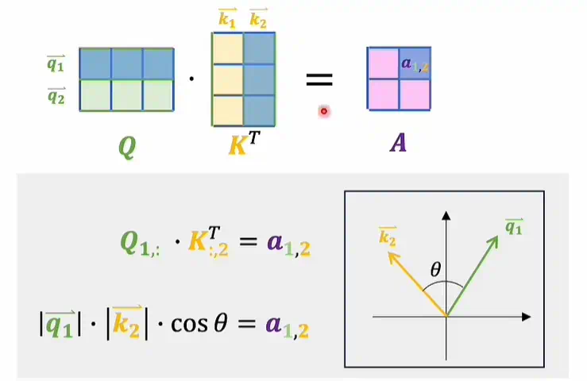
> - V其实表示的是从词典里查出来的token的客观语义，而$ QK^T=A $则表示这段话因为上下文关联而产生的修改系数；
> - 上图可以看出Q的一行与K的转置的一列进行内积可以看成是投影运算，从内积的大小可以体现出两个向量之间的关系

### self-Attention和cross-Attention

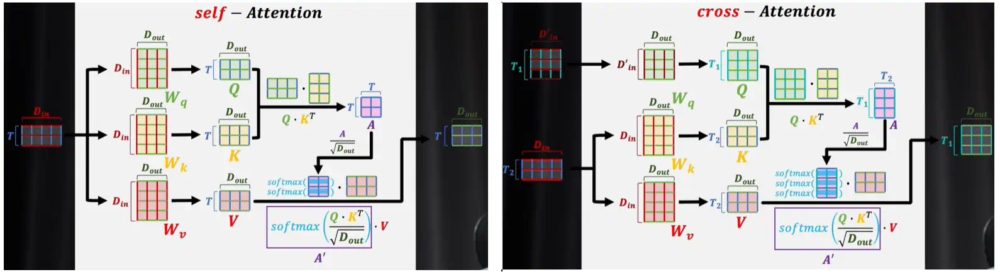

transformer中编码器和解码器的Multi-Head Attention根据输入的不同，分为self-attention和cross-attention；

> - 编码器是self-attention，其中去生成QKV的的输入来源于相同的数据；
> - 解码器是cross-attention，其中KV的的输入来源于编码器；

### Multi-Head Attention

与其使用 $ d_{model} $维的键、值和查询的单一注意力函数，不如将查询、键和值分别通过h组不同的可学习线性投影，线性映射到 $ d_k $、 $ d_k $和 $ d_v $维，这样做的效果更好。然后，在查询、键和值的每个投影版本上，我们并行执行 attention 函数，产生 $ d_v $维度的输出值。这些值被连接起来并再次投影，从而得到最终值，如下图 所示。  $ d_{model}=521 $

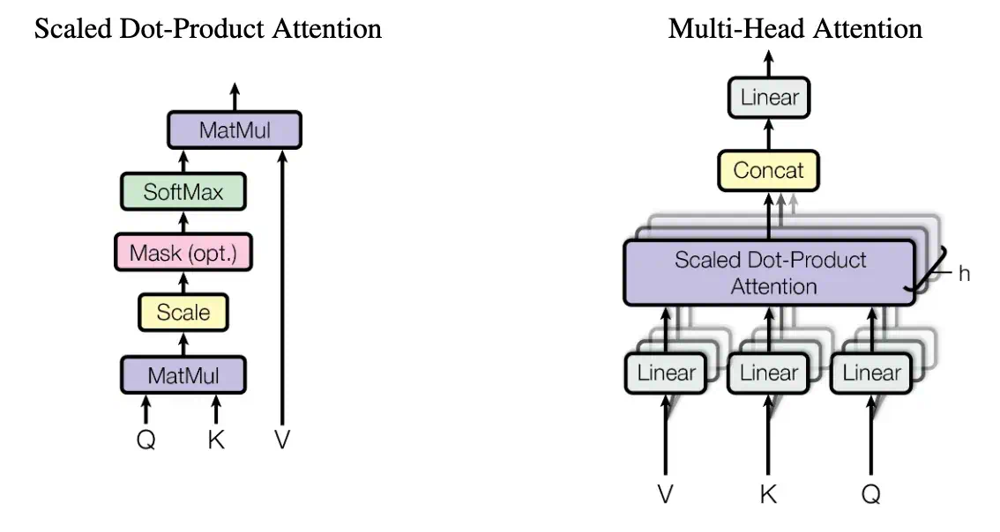

多头注意力允许模型共同关注来自不同位置的不同表示子空间的信息。对于单个注意力头，平均会抑制这种情况。
$$
MultiHead(Q,K,V)=Concat(head_1,...,head_h)W^o
$$

$$
head_i=Attention(QW_{i}^{Q},KW_{i}^{K},VW_{i}^{V})
$$

$$
W_{i}^{Q}\in R^{d_{model}*d_k},W_{i}^{K}\in R^{d_{model}*d_k},W_{i}^{V}\in R^{d_{model}*d_v},W_{i}^{O}\in R^{hd_{v}*d_{model}},
d_k = d_v = d_{model}/h = 64,h=8
$$

$$
W_{i}^{Q}\in R^{521*64},W_{i}^{K}\in R^{521*64},W_{i}^{V}\in R^{521*64},W_{i}^{O}\in R^{521*521}
$$

​    在原文中，使用了 h = 8 个平行的注意力层或头部。对于这些中的每一个，用 $ d_k = d_v = d_{model}/h = 64 $。由于每个头部的维度减小，总计算成本与具有全维数的单头部注意力相似。

便于更好的理解，假设有三头注意力机制，这三个注意力机制的系数各自独立，学到的东西各不相同。单个注意力头可能只能关注输入的某一个方面或一种关系，而多头注意力机制通过**并行地学习多个子空间中的注意力**，可以从不同的角度理解输入序列。不同的头使用不同的线性变换权重，关注输入序列中不同位置之间的依赖关系，从而使模型能捕捉到更丰富的语义特征：

> - 某些注意力头可以关注**局部信息**（如相邻词语之间的依赖）；
> - 另一些头可以捕捉**长距离依赖**（如前后语义关联）；
> - 有的可能学习到**语法结构**，有的则偏向于**词义或实体识别**等。

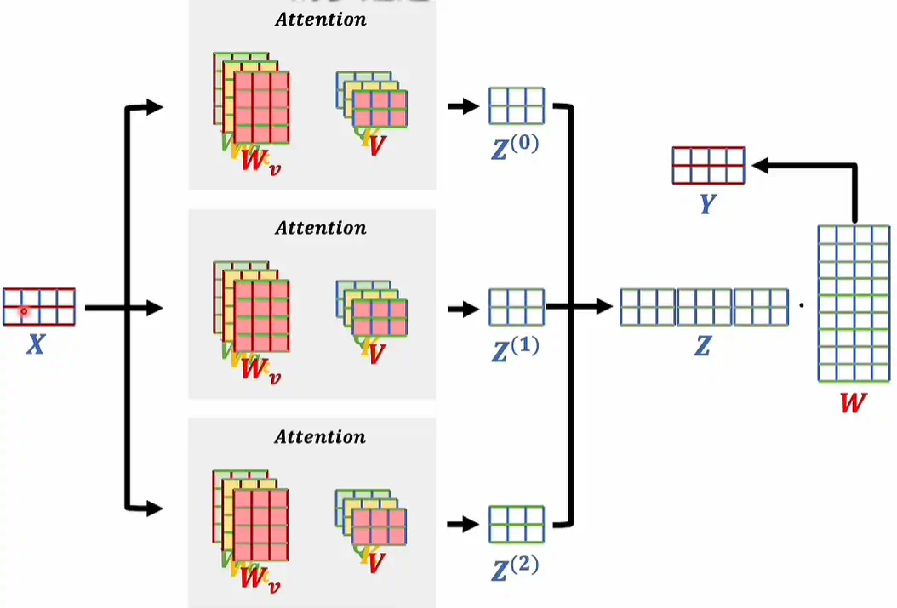

**掩码自注意力机制**

注意力得分矩阵A可以包含一个词和所有上下文之间的关系，需要把矩阵A如下图部分的词给屏蔽掉，把这些位置分别设置为无穷小，这样在softmax计算时一定为0了；

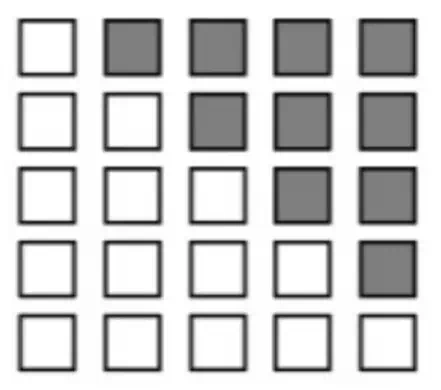

## 全连接前馈神经网络

Position-wise Feed-Forward Networks  除了attention sub-layers之外，编码器和解码器中的每个层都包含一个完全连接的前馈网络，该网络分别且相同地应用于每个位置。这包括两个线性变换，中间有一个 ReLU 激活（$ y=max(0, x) $, 这意味着对于所有正值，ReLU是线性的，而对于所有负值，ReLU的输出为零。）。
$$
FFN(x)=max(0,xW_1+b_1)W_2+b_2
$$
虽然线性变换在不同位置上是相同的，但它们在不同层之间使用不同的参数。输入和输出的维数为$ d_{model} = 512 $ ，内层的维数为 $ d_{ff} = 2048 $。

## Add & Norm

### 残差网络Add

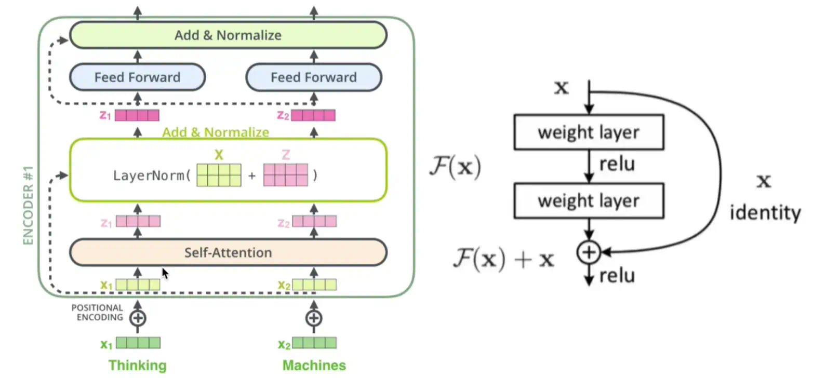

输出不再是$ F(x) $ ，而是 $ F(x)+x $；使用残差网络的原因是为了防止连乘导致梯度消失。

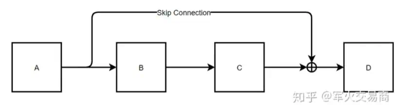
根据后向传播的链式法则
$$
\frac{\partial L}{\partial X_{Aout}} = \frac{\partial L}{\partial X_{Din}}  \frac{\partial X_{Din}}{\partial X_{Aout}}
$$

$$
\text{而}X_{Din} = X_{Aout} + C(B(X_{Aout}))
$$

$$
\text{所以：} \frac{\partial L}{\partial X_{Aout}} = \frac{\partial L}{\partial X_{Din}} [1+\frac{\partial X_{Din}}{\partial X_{C}} \frac{\partial X_{C}}{\partial X_{B}} \frac{\partial X_{B}}{\partial X_{Aout}}]
$$

梯度消失的原因一般是因为连乘，但是括号里的$ \frac{\partial X_{Din}}{\partial X_{C}} \frac{\partial X_{C}}{\partial X_{B}} \frac{\partial X_{B}}{\partial X_{Aout}} $部分前面有一个1，确保了梯度不会为0，因此缓解了梯度消失的出现，这也是为什么NLP任务中可以使用比较深的网络的原因。	
				

### Layer Normalization		

Normalization：规范化或标准化，就是把输入数据X，在输送给神经元之前先对其进行平移和伸缩变换，将数据X的分布规范化成在固定区间范围的标准分布。因为神经网络的Block大部分都是矩阵运算，一个向量经过矩阵运算后值会越来越大，为了网络的稳定性，我们需要及时把值拉回正态分布。
$$
h=f(g\frac{x-\mu}{\sigma}+b)
$$
Normalization根据标准化操作的维度不同可以分为batch Normalization和Layer Normalization：

> BatchNorm是对一个batch-size样本内的每个特征分别做归一化;
>
> LayerNorm是分别对每个样本的所有特征做归一化。

在BN和LN都能使用的场景中，BN的效果一般优于LN，原因是基于不同数据，同一特征得到的归一化特征更不容易损失信息。但是有些场景是不能使用BN的，例如batch size较小或者序列问题中可以使用LN。这也就解答了**RNN 或Transformer为什么用Layer Normalization？**

> - RNN或Transformer解决的是序列问题，一个存在的问题是不同样本的序列长度不一致，而Batch Normalization需要对不同样本的同一位置特征进行标准化处理，所以无法应用；当然，输入的序列都要做padding补齐操作，但是补齐的位置填充的都是0，这些位置都是无意义的，此时的标准化也就没有意义了。
>
> - 上面说到，BN抹杀了不同特征之间的大小关系；LN是保留了一个样本内不同特征之间的大小关系，这对NLP任务是至关重要的。对于NLP或者序列任务来说，一条样本的不同特征，其实就是时序上的变化，这正是需要学习的东西自然不能做归一化抹杀，所以要用LN。

# Decoders

**1、 掩码多头注意力机制**

​          增强泛化能力

**2、 交叉注意力机制**

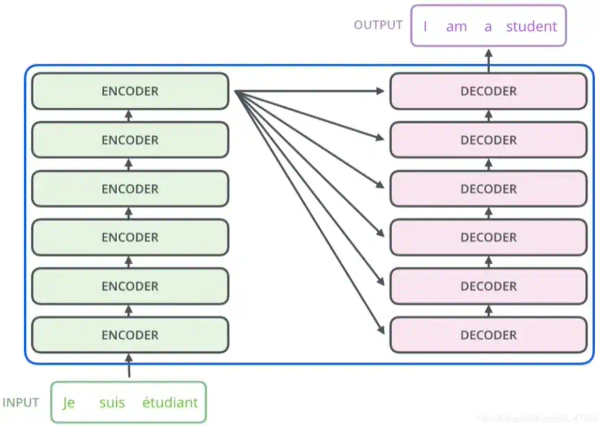

Encoders的输出与每一个Encoder进行交互，Encoders生成的KV矩阵

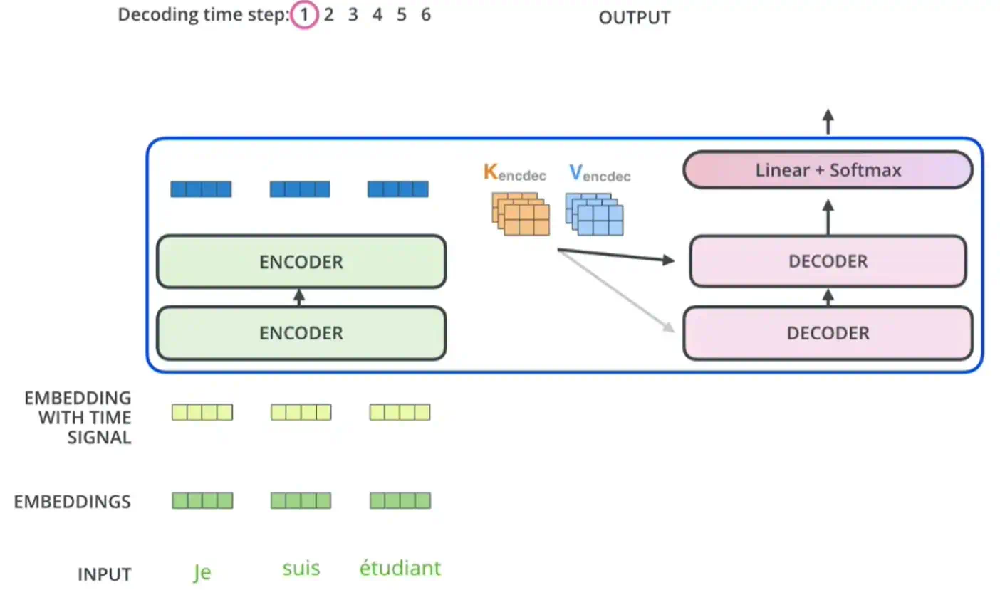

# 基于transformer发展的大语言模型

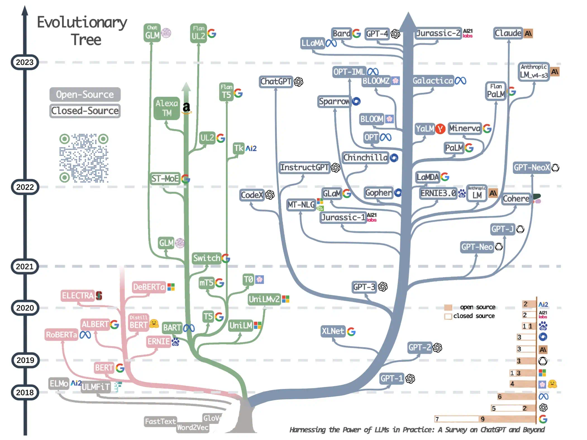

参考资料：

[从编解码和词嵌入开始，一步一步理解Transformer，注意力机制(Attention)的本质是卷积神经网络(CNN)_哔哩哔哩_bilibili](https://www.bilibili.com/video/BV1XH4y1T76e?spm_id_from=333.788.player.player_end_recommend_autoplay&vd_source=93e39300d281cef5ad42ab13d4028d04)

https://zhuanlan.zhihu.com/p/110219298

