QUIC是一种加密、多路复用和低延迟的传输协议，旨在提高HTTPS流量的传输性能，并实现传输机制的快速部署和持续发展。QUIC已在Google全球数千台服务器上部署，并用于向一系列客户端提供流量，包括广泛使用的Web浏览器(Chrome)和流行的移动的视频流应用程序(YouTube)。

[The QUIC Transport Protocol | Proceedings of the Conference of the ACM Special Interest Group on Data Communication](https://dl.acm.org/doi/10.1145/3098822.3098842)

[QUIC，一种基于 UDP 的多路复用传输](https://www.chromium.org/quic/)

# HTTP发展史

 [一文读懂 HTTP/1HTTP/2HTTP/3 - 知乎 2020-05-25](https://zhuanlan.zhihu.com/p/102561034)

​	从 1989 年万维网（www）诞生，HTTP（HyperText Transfer Protocol）经历了众多版本迭代，[WebSocket](https://zhida.zhihu.com/search?content_id=110922002&content_type=Article&match_order=1&q=WebSocket&zhida_source=entity) 也在期间萌芽。1991 年 HTTP0.9 被发明。1996 年出现了 HTTP1.0。2015 年 [HTTP2](https://zhida.zhihu.com/search?content_id=110922002&content_type=Article&match_order=1&q=HTTP2&zhida_source=entity) 正式发布。2020 年 [HTTP3](https://zhida.zhihu.com/search?content_id=110922002&content_type=Article&match_order=1&q=HTTP3&zhida_source=entity) 或能正式使用。

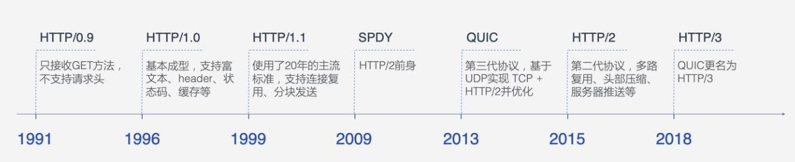

- HTTP1.1

  > 缺陷
  >
  > 队头阻塞：一个TCP连接通道同一时刻只能处理一个请求，在当前的请求没有结束之前，其他的请求只能处于阻塞状态；
  >
  > 无状态特性：对于连接状态没有记忆能力，每一个连接都是一个新的连接；
  >
  > 不安全性：传输内容没有加密，中途可能被篡改和劫持；
  >
  > 不支持服务端主动推送。

- SPDY协议

  随着网络技术的发展，1999 年设计的 HTTP/1.1 已经不能满足需求，所以 Google 在 2009 年设计了基于 TCP 的 SPDY ，后来 SPDY 的开发组推动 SPDY 成为正式标准，不过最终没能通过。不过 SPDY 的开发组全程参与了 HTTP/2 的制定过程，参考了 SPDY 的很多设计，所以我们一般认为 SPDY 就是 HTTP/2 的前身。

  > 特性
  >
  > 多路复用：允许一个连接上可以无限制的并发流；(解决对头阻塞)
  >
  > 头部压缩：使用专门的HPACK算法，每次请求和响应只发送差异头部，一般可以达到 50%~90% 的高压缩率。
  >
  > 请求优先级：在网络通道被非关键资源堵塞时，高优先级的请求会被优先处理。
  >
  > 服务端推送：可以让服务端主动把资源文件推送给客户端。
  >
  > 提高安全性：支持使用 HTTPS 进行加密传输。

- HTTP2

  HTTP2 基于 SPDY，专注于性能，最大的一个目标是在用户和网站间只用一个连接。

  - 新增特性

    > 二进制分帧：首先，HTTP2 没有改变 HTTP1 的语义，只是在应用层使用二进制分帧方式传输。因此，也引入了新的通信单位：**帧、消息、流**。为多路复用提供了底层支持。
    >
    > 多路复用：一个域名对应一个连接，一个流代表了一个完整的**请求-响应**过程。**帧**是最小的数据单位，每个**帧**会标识出该帧属于哪个**流**，**流**也就是多个帧组成的数据流。多路复用，就是在一个 TCP 连接中可以存在多个流。

  - 缺陷

    > TCP 以及 TCP+TLS 建立连接的延时；
    >
    > TCP 的队头阻塞并没有彻底解决：TCP 为了保证可靠传输，有一个“超时重传”机制，丢失的包必须等待重传确认。HTTP2 出现丢包时，整个 TCP 都要等待重传，那么就会阻塞该 TCP 连接中的所有请求。

# 为什么需要QUIC？

[科普：QUIC协议原理分析 - 知乎](https://zhuanlan.zhihu.com/p/32553477)

一方面是历史悠久使用广泛的古老协议，另外一方面用户的使用场景对传输性能的要求又越来越高。如下几个由来已久的问题和矛盾就变得越来越突出。

1. 协议历史悠久导致中间设备僵化。

   > TCP 协议本来是支持端口、选项及特性的增加和修改。但是由于 TCP 协议和知名端口及选项使用的历史太悠久，中间设备已经依赖于这些潜规则，所以对这些内容的修改很容易遭到中间环节的干扰而失败。

2. 依赖于操作系统的实现导致协议本身僵化。

   > TCP 是由操作系统在内核协议栈层面实现的，操作系统升级很麻烦，所以 TCP 的迭代却非常缓慢。

3. 建立连接的握手延迟大。

4. HTTP/没有彻底解决队头阻塞。

   > 队头阻塞主要是 TCP 协议的可靠性机制引入的。TCP 使用序列号来标识数据的顺序，数据必须按照顺序处理，如果前面的数据丢失，后面的数据就算到达了也不会通知应用层来处理。
   >
   > 另外 TLS 协议层面也有一个队头阻塞，因为 TLS 协议都是按照 record 来处理数据的，如果一个 record 中丢失了数据，也会导致整个 record 无法正确处理。

​	总之，TCP 和 TLS1.2 之前的协议存在着结构性的问题，如果继续在现有的 TCP、TLS 协议之上实现一个全新的应用层协议，依赖于操作系统、中间设备还有用户的支持。部署成本非常高，阻力非常大。

​	无论 SPDY 还是 HTTP/2，都是基于 TCP 的，而UDP 相比效率上存在天然的劣势，因为 UDP 本身没有连接的概念，不需要三次握手，优化了连接建立的握手延迟，同时在应用程序层面实现了 TCP 的可靠性，TLS 的安全性和 HTTP2 的并发性，只需要用户端和服务端的应用程序支持 QUIC 协议，完全避开了操作系统和中间设备的限制。所以 2013 年 Google 开发了基于 UDP 的名为 [QUIC](https://zhida.zhihu.com/search?content_id=120012913&content_type=Article&match_order=1&q=QUIC&zhida_source=entity) 的传输层协议，QUIC 全称 Quick UDP Internet Connections，希望它能替代 TCP，使得网页传输更加高效。后经**[提议](https://link.zhihu.com/?target=https%3A//mailarchive.ietf.org/arch/msg/quic/RLRs4nB1lwFCZ_7k0iuz0ZBa35s)**，互联网工程任务组正式将基于 QUIC 协议的 HTTP （[HTTP over QUIC](https://zhida.zhihu.com/search?content_id=120012913&content_type=Article&match_order=1&q=HTTP+over+QUIC&zhida_source=entity)）重命名为 HTTP/3。它真正“完美”地解决了“队头阻塞”问题。	

QUIC，你就记住两个核心：采用UDP传输层、使用TLS 1.3协议

# QUIC生态圈发展简史

下图是 QUIC 从创建到现在为止的一些比较重要的时间节点，2021 年，QUIC V1 即将成为 RFC，结束百花齐放的态势。

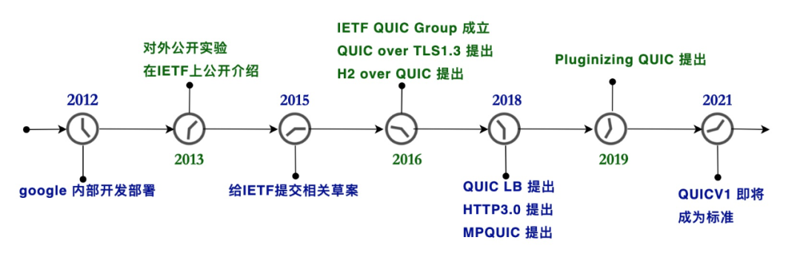

# QUIC协议详解

[科普：QUIC协议原理分析 - 知乎](https://zhuanlan.zhihu.com/p/32553477)

[QUIC 协议详解 - 知乎](https://zhuanlan.zhihu.com/p/405387352)

[HTTP/3 原理实战 - 知乎](https://zhuanlan.zhihu.com/p/143464334)

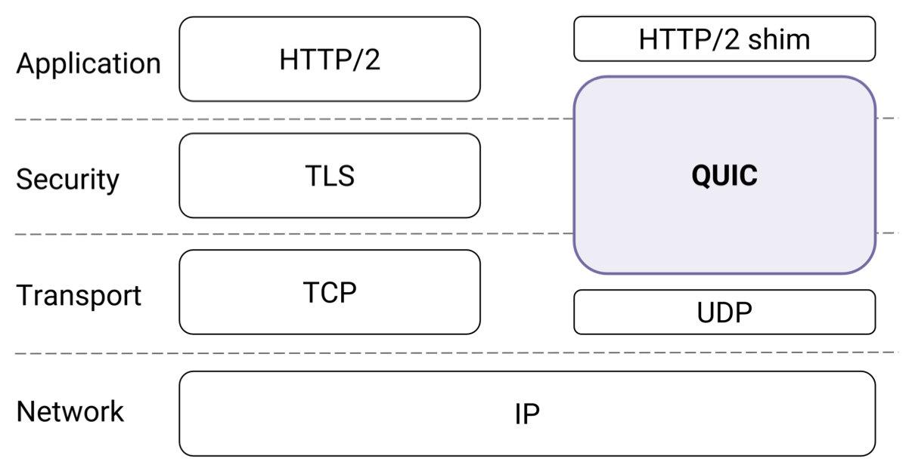

从协议栈可以看出：QUIC = HTTP/2 + TLS1.3+ UDP

## 数据包结构

一个 QUIC 数据包的格式如下：

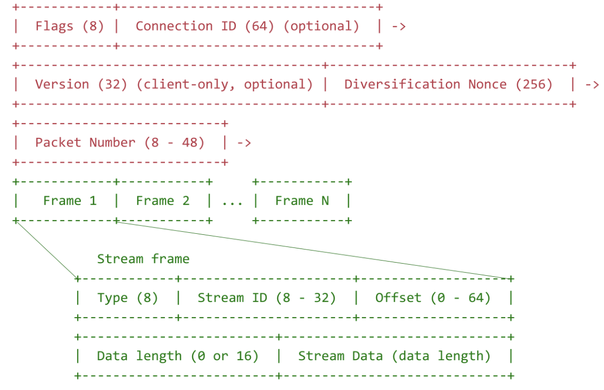

- 由header和data两部分组成：

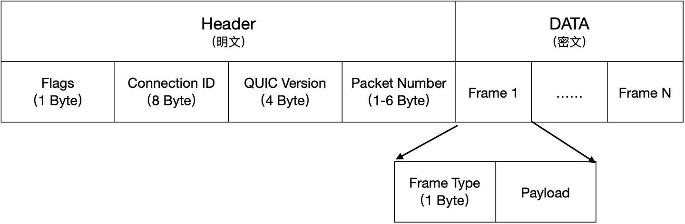

- Frame Type: 数据帧的类型，标识了它的用途，占用1个字节

  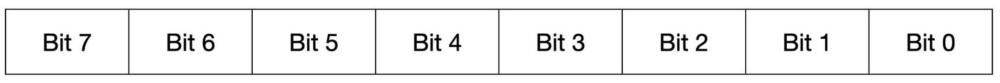

  > Bit 7：必须设置为 1，表示 Stream 帧;
  >
  > Bit 6：如果设置为 1，表示发送端在这个 stream 上已经结束发送数据，流将处于半关闭状态;
  >
  > Bit 5：如果设置为 1，表示 Stream 头中包含 Data length 字段;
  >
  > Bit 4,3,2：表示 offset 的长度。000 表示 0 字节，001 表示 2 字节，010 表示 3 字节，以此类推;
  >
  > Bit 1,0：表示 Stream ID 的长度。00 表示 1 字节，01 表示 2 字节，10 表示 3 字节，11 表示 4 字节。
  >
  > 一些常见的数据帧类型：
  >
  > 1. **PING帧：** 用于测试连接的可用性。PING帧不包含负载，只是用于确认连接是否存活。
  > 2. **ACK帧：** 用于确认收到的数据包。它包含有关已收到的数据包的信息，以确保数据的可靠传输。
  > 3. **RESET_STREAM帧：** 用于重置特定数据流的状态。当一个数据流需要被中断或重新开始时，可以使用RESET_STREAM帧。
  > 4. **STOP_SENDING帧：** 用于停止向特定的数据流发送数据。这可以用于暂停数据传输或处理异常情况。
  > 5. **CRYPTO帧：** 用于传输加密数据。在QUIC中，加密通常是在连接建立过程中进行的，CRYPTO帧用于在已建立的连接上传输加密的应用层数据。
  > 6. **STREAM帧：** 用于传输普通数据流。STREAM帧可以包含应用层数据，用于在连接上进行双向通信，支持多路复用。

- Payload：应用数据

  > Stream ID： 流 ID，用于标识数据包所属的流。后面的流量控制和多路复用会涉及到
  >
  > Offset：偏移量，表示该数据包在整个数据中的偏移量，用于数据排序。
  >
  > Data Length：数据长度，占用 2 个字节，表示实际应用数据的长度
  >
  > Data：实际的应用数据

## 0RTT建立连接

- 0RTT建立连接

  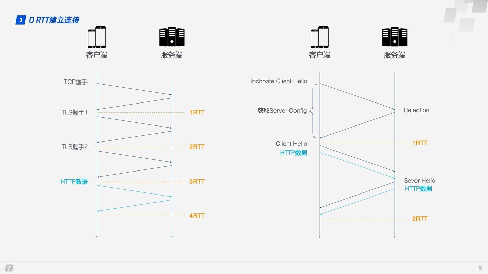

  - HTTP/2的连接需要三次握手3RTT，如果考虑会话复用，即把第一次握手算出来的对称密钥缓存起来，那么也需要 2 RTT；

  - QUIC基于TLS1.3实现，只需在首次建立连接时需要1RTT，后续再次连接只需0RTT；

    > 原理：在首次连接时，客户端缓存了ServerConfig，下次建连直接使用缓存数据计算通信密钥。

- 前向安全性

  假设攻击者记录下所有的通信数据和公开参数，一旦服务器的私钥泄漏了，那之前通信的所有数据就都可以破解了。为了解决这个问题，需要为每次会话都创建一个新的通信密钥，来保证[前向安全](https://zhida.zhihu.com/search?content_id=178216113&content_type=Article&match_order=1&q=前向安全&zhida_source=entity)性。

  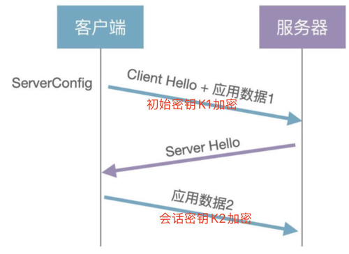

  客户端缓存的 ServerConfig 是服务器静态配置的，是可以长期使用的。客户端通过 ServerConfig 实现 0-RTT 握手，使用会话密钥 sessionKey 保证通信数据的前向安全。QUIC不会使用复用会话密钥，每次连接都生成一个新的密钥；

  > （1）客户端：
  >
  > - **生成随机数 a**，选择公开的大数 G 和 P，计算 A=a*G%P，将 A 和 G 发送给服务器，也就是 Client Hello 消息。
  >
  > - 直接使用缓存的 ServerConfig **计算初始密钥 initKey** (K1)= aB = ab*G%P，加密发送应用数据 1；
  >
  > （2）服务器：
  >
  > - 根据 Client Hello 消息**解码初始密钥 initKey** = bA = ba*G%P
  >
  > - **生成随机数 c**，计算 C=c*G%P，**使用 initKey 加密 C**，发送给客户端，也就是 Server Hello 消息
  >
  > （3）客户端：**使用 initKey 解码获取 C**，**计算会话密钥 sessionKey** (k2)= a*C = a*c*G%P，加密发送应用数据 2;
  >
  > （4）服务器：计算会话密钥 sessionKey = c*A = c*a*G%P，解密获取应用数据 2

## 连接迁移

什么叫连接迁移呢？

​	就是当其中任何一个元素发生变化时，这条连接依然维持着，能够保持业务逻辑不中断。当然这里面主要关注的是客户端的变化，因为客户端不可控并且网络环境经常发生变化，而服务端的 IP 和端口一般都是固定的。比如大家使用手机在 WIFI 和 4G 移动网络切换时，客户端的 IP 肯定会发生变化，需要重新建立和服务端的 TCP 连接。又比如大家使用公共 NAT 出口时，有些连接竞争时需要重新绑定端口，导致客户端的端口发生变化，同样需要重新建立 TCP 连接。

- TCP的连接基于四元组：`源IP、源端口、目的IP、目的端口`；只要其中一个发生变化，就需要重新连接。
- QUIC的连接基于64位的随机数Connection ID，网络切换并不会影响Connetion ID的变化。

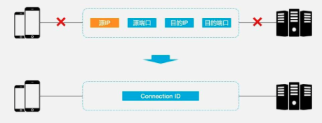

## 队头阻塞/多路复用

- HTTP/1.1：只有上一个请求的所有数据包被传输完毕下一个请求的数据包才可以传输;

- HTTP/2：可以同时并行处理多个请求，每个请求被拆分为多个数据包通过一条TCP连接同时被传输。

  ​	一个请求就对应一条流，通过 Stream ID 就可以判断该数据帧属于哪个请求，假设有 A 和 B 两个请求，对应的 Stream ID 分别为 1 和 2，那这个 TCP 连接上传输的数据大概如下：

  

  虽然在 HTTP 应用层，可以同时发送多个请求，但是在 TCP 传输层，仍然只有 1 个滑动窗口来发送这些数据包，考虑下面的情形：

  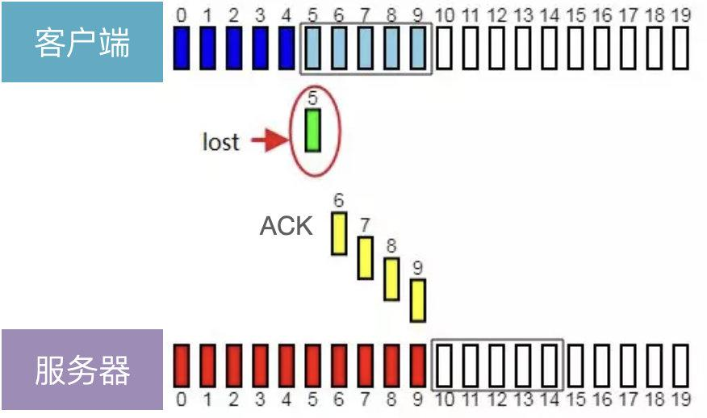

  客户端发送的 5 个数据包（56789）服务器都收到了，并且回应了 5 个 ACK，但是第 5 个数据包的 ACK 丢失了，导致客户端的发送窗口无法向前移动，也就无法发送新的数据。但是如果发生丢包，应用层需要等待丢包的重传，才能继续读取后面的数据包，即使其他流的数据包已经到达仍不能处理，这整条连接会发生阻塞。这就是 TCP 层的队头阻塞问题。

  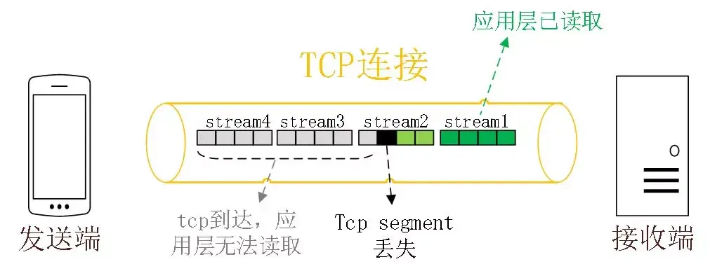

  不仅如此，由于 HTTP/2 强制使用 HTTPS，而 HTTPS 使用的 TLS 协议也存在队头阻塞问题。TLS 基于 Record 组织数据，将一堆数据放在一起（即一个 Record）加密，加密完后又拆分成多个 TCP 包传输。Record 是 TLS 协议处理的最小单位，一般每个 Record 16K，包含 12 个 TCP 包。由于一个 record 必须经过数据一致性校验才能进行加解密，如果 12 个 TCP 包中有任何一个包丢失，那么整个 Record 都无法解密。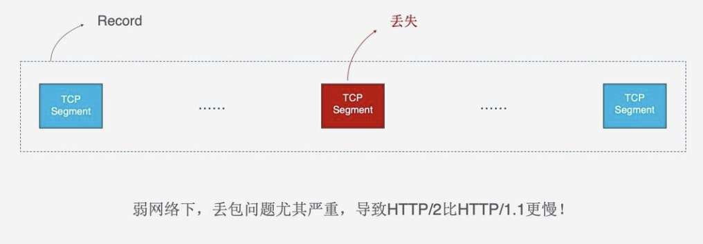

  HTTP/2 虽然通过多路复用解决了 HTTP 层的队头阻塞，但仍然存在 TCP 层的队头阻塞。

- 那 QUIC 是如何解决 TCP 层的队头阻塞问题的呢？其实很简单，HTTP/2 之所以存在 TCP 层的队头阻塞，是因为所有请求流都共享一个滑动窗口，那如果给每个请求流都分配一个独立的滑动窗口，是不是就可以解决这个问题了？QUIC 就是这么做的： 

  - **独立的逻辑流：** QUIC允许在单个连接上并行传输多个逻辑数据流。每个数据流都是独立管理的，这意味着一个数据流的延迟或中断不会影响其他数据流的传输。这有助于提高网络效率，特别是在处理多个请求和响应时。

  - **避免HOL（Head-of-Line）阻塞：** QUIC通过允许多个数据流在单个连接上独立传输，解决了HOL阻塞问题。这意味着即使一个数据流遇到问题，其他数据流仍然可以继续传输，而不会受到影响。这有助于提高整体效率和性能。

  - **避免 TLS 协议存在的队头阻塞：**QUIC 最基本的传输单元是 Packet，不会超过最大传输单元MTU 的大小，整个加密和认证过程都是基于 Packet 的，不会跨越多个 Packet。这样就能避免 TLS 协议存在的队头阻塞；

    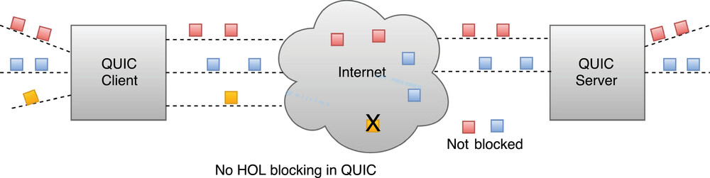
    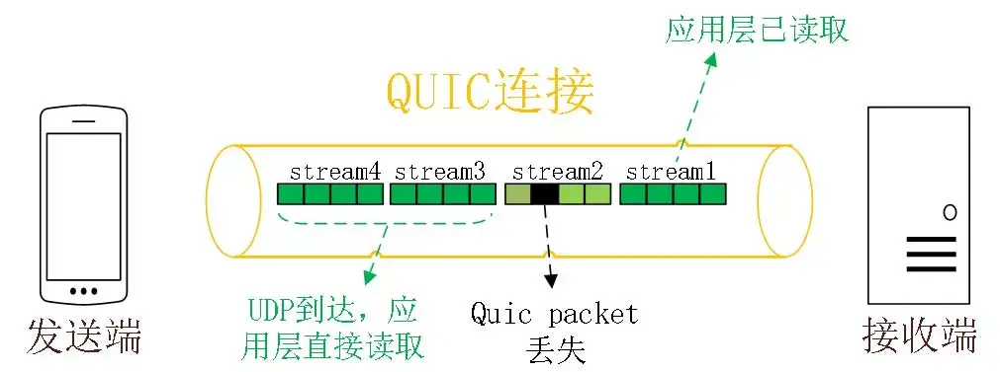

  - 当然，并不是所有的 QUIC 数据都不会受到队头阻塞的影响，比如 QUIC 当前也是使用 [Hpack 压缩算法](https://zhida.zhihu.com/search?content_id=5210566&content_type=Article&match_order=1&q=Hpack+压缩算法&zhida_source=entity) ，由于算法的限制，丢失一个头部数据时，可能遇到队头阻塞。

    > **HPACK 和 QPACK 的工作原理**
    >
    > HTTP/2（HPACK）和 HTTP/3（QPACK）都使用头部压缩技术来减少请求/响应的开销，但它们的实现方式不同，主要区别在于 **如何避免队头阻塞（HOL Blocking）**。
    >
    > 1、HPACK
    >
    > HPACK 是 HTTP/2 的头部压缩算法，它通过 **静态表 + 动态表 + Huffman 编码** 来减少头部大小。
    >
    > - 静态表
    >
    >   HPACK 预定义了 61 个常见 HTTP 头部字段（如 `:method: GET`、`:path: /`），客户端和服务器可以直接引用它们的索引号，而无需传输完整字符串。
    >
    >   | 索引 | 头部字段       | 值          |
    >   | ---- | -------------- | ----------- |
    >   | 2    | `:method`      | `GET`       |
    >   | 4    | `:path`        | `/`         |
    >   | 24   | `content-type` | `text/html` |
    >
    >   如果客户端发送 `GET /index.html`，可以编码为：
    >
    >   ```bash
    >   :method: GET   → 索引 2  
    >   :path: /index.html → 先发送索引 4（/），再发送 "index.html"（Huffman 编码）
    >   ```
    >
    > - 动态表
    >
    >   HPACK 允许客户端和服务器在通信过程中动态添加头部字段到动态表，后续请求可以引用这些索引，减少重复传输。
    >
    >   **示例：**
    >
    >   1. 第一次请求：
    >
    >      ```
    >      user-agent: Mozilla/5.0
    >      ```
    >
    >      → 动态表新增条目（假设索引 62）。
    >
    >   2. 第二次请求：
    >
    >      ```
    >      user-agent: Mozilla/5.0
    >      ```
    >
    >      → 直接发送索引 62，无需再传完整字符串。
    >
    > - Huffman编码
    >
    >   对于不在表中的头部字段，HPACK 使用 Huffman 编码进一步压缩字符串。
    >
    > 由于 HPACK 的 **动态表是按顺序更新** 的，如果某个头部帧丢失，后续帧可能无法正确解码（因为它们可能依赖丢失的动态表更新）。
    >
    > 2、QPACK
    >
    > QPACK 是 HTTP/3 的头部压缩算法，针对 QUIC 的无序传输特性优化，动态表更新（Encoder Stream）和头部帧分离，避免阻塞。
    >
    > - 仍然使用静态表 + 动态表
    >
    >   QPACK 保留了 HPACK 的静态表和动态表机制，但 **动态表的更新方式不同**。
    >
    > - 引入“单向流”管理动态表
    >
    >   HPACK 的动态表更新和头部帧在同一个流上传输，而 QPACK 使用 **两个独立的单向流**：
    >
    >   **Encoder Stream（编码流）**：客户端 → 服务器，用于更新动态表（新增/删除条目）。
    >
    >   **Decoder Stream（解码流）**：服务器 → 客户端，用于确认动态表更新是否成功。
    >
    > - 允许乱序引用
    >
    >   QPACK 允许头部帧 **引用尚未确认的动态表条目**，但需要额外的机制（如“相对索引”）来保证正确解码。

## 拥塞控制

​	TCP 拥塞控制由 4 个核心算法组成：慢启动、拥塞避免、快速重传和快速恢复；

​	QUIC 协议当前默认使用了 TCP 协议的 [Cubic 拥塞控制算法](https://zhida.zhihu.com/search?content_id=5210566&content_type=Article&match_order=1&q=Cubic+拥塞控制算法&zhida_source=entity) ，并在此基础上做了不少改进。同时也支持 CubicBytes, Reno, RenoBytes, BBR, PCC 等拥塞控制算法。下面介绍一些 QUIC 改进的拥塞控制的特性。

### 热插拔

什么叫可插拔呢？就是能够非常灵活地生效，变更和停止。

1. QUIC 修改拥塞控制策略只需要在应用层操作，不需要操作系统，不需要内核支持。

   > 这是一个飞跃，因为传统的 TCP 拥塞控制的修改，需要在系统层面进行操作，必须要端到端的网络协议栈支持，才能实现控制效果。而内核和操作系统的部署成本非常高，升级周期很长，这在产品快速迭代，网络爆炸式增长的今天，显然有点满足不了需求。

2. QUIC 会根据不同的网络环境、用户来动态选择拥塞控制算法。即使是单个应用程序的不同连接也能支持配置不同的拥塞控制。

   > 就算是一台服务器，接入的用户网络环境也千差万别，结合大数据及人工智能处理，能为各个用户提供不同的但又更加精准更加有效的拥塞控制。比如 BBR 适合，Cubic 适合。关于应用层的可插拔拥塞控制模拟，可以对 socket 上的流为对象进行实验。

3. 应用程序不需要停机和升级就能实现拥塞控制的变更，我们在服务端只需要修改一下配置，reload 一下，完全不需要停止服务就能实现拥塞控制的切换。

### 可靠性传输

​	QUIC 同样是一个可靠的协议，它使用 Packet Number 代替了 TCP 的 sequence number，并且每个 Packet Number 都严格递增，也就是说就算 Packet N 丢失了，重传的 Packet N 的 Packet Number 已经不是 N，而是一个比 N 大的值。这样发送方接收到确认消息时就能方便地知道 ACK 对应的是原始包还是重传包的响应了。

解决了TCP重传模糊问题：TCP连接对于原始包和重传包接收到的 ACK 序号一样，客户端无法分清ACK是原始包还是重传包的响应，此时会影响RTT的采样，如果客户端认为是重传包的 ACK，但实际上是原始包的ACK，会导致采样 RTT 偏小，使得超时重传时间偏小。


### 流量控制

TCP 会对每个 TCP 连接进行流量控制，流量控制的意思是让发送方不要发送太快，要让接收方来得及接收，不然会导致数据溢出而丢失，TCP 的流量控制主要通过滑动窗口来实现的。可以看出，拥塞控制主要是控制发送方的发送策略，**但没有考虑到接收方的接收能力**，流量控制是对这部分能力的补齐。QUIC考虑到接收方的接受能力；

- **基于 stream 和 connection 级别的流量控制。**

  为什么需要两类流量控制呢？主要是因为 QUIC 支持多路复用。 Stream 可以认为就是一条 HTTP 请求。 Connection 可以类比一条 TCP 连接。多路复用意味着在一条 Connetion 上会同时存在多条 Stream。

  - 基于 stream

    QUIC 接收者会通告每个流中最多想要接收到的数据的绝对字节偏移。随着数据在特定流中的发送，接收和传送，接收者发送 WINDOW_UPDATE 帧，该帧增加该流的通告偏移量限制，允许对端在该流上发送更多的数据。

  - 基于连接级别的流控制

    QUIC 还实现连接级的流控制，以限制 QUIC 接收者愿意为连接分配的总缓冲区。连接的流控制工作方式与流的流控制一样，但传送的字节和最大的接收偏移是所有流的总和。

    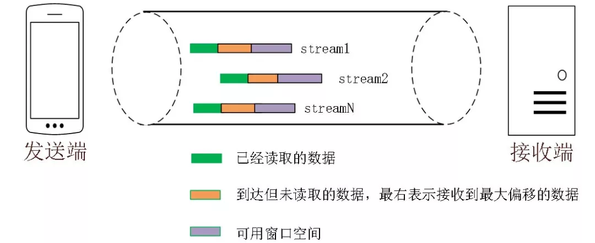

- QUIC 实现流量控制的原理比较简单：

  通过 window_update 帧告诉对端自己可以接收的字节数，这样发送方就不会发送超过这个数量的数据。通过 BlockFrame 告诉对端由于流量控制被阻塞了，无法发送数据。

  QUIC 的流量控制和 TCP 有点区别，TCP 为了保证可靠性，窗口左边沿向右滑动时的长度取决于已经确认的字节数。如果中间出现丢包，就算接收到了更大序号的 Segment，窗口也无法超过这个序列号。

- 拥塞控制是通过拥塞窗口限制发送方的数据量，避免整个网络发生拥塞。那拥塞窗口（cwnd）和滑动窗口（发送窗口：swnd，接收窗口：rwnd）有什么关系呢？

  swnd = min（cwnd，rwnd）

  也就是说，发送窗口的大小是由接收窗口和拥塞窗口共同决定的。那拥塞窗口的大小是如何计算的？通过 4 个拥塞控制算法：慢启动、拥塞避免、拥塞发生、快速恢复

  - 慢启动：初始拥塞窗口大小cwnd=1，当发送方每收到一个 ACK，拥塞窗口就加 1（cwnd++）；

    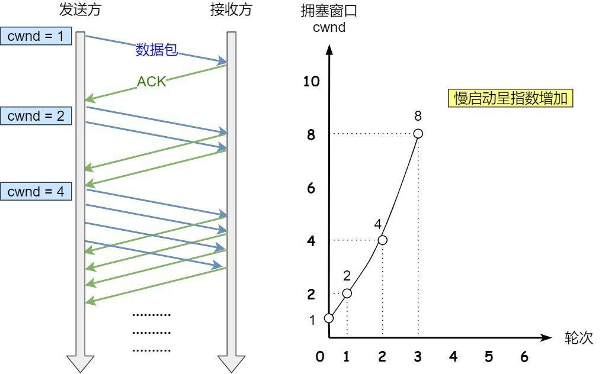

  - 拥塞避免：当拥塞窗口大小超过慢启动上限后，就会进入拥塞避免阶段。由此可知，在拥塞避免阶段，拥塞窗口是线性增长的。

    > **拥塞避免算法：** 当发送方每收到一个 ACK，拥塞窗口就加 1/cwnd；

    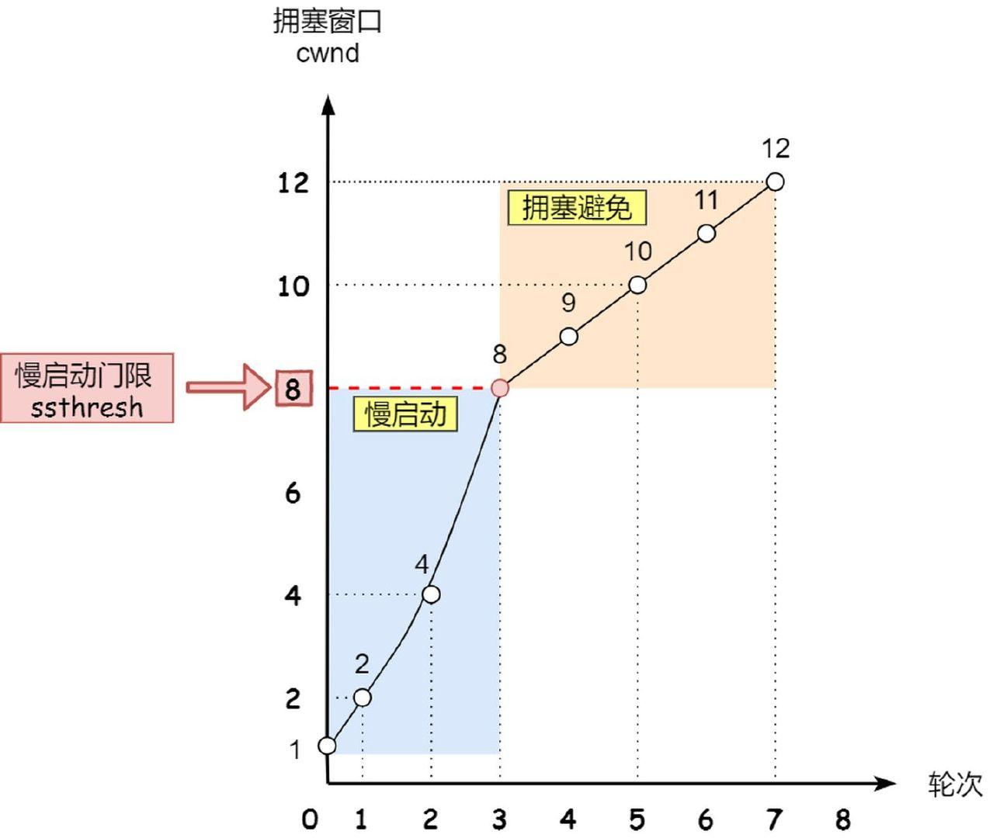

  - 拥塞发生：重传有两种(超时重传和快速重传)

    1、超时重传，使用的拥塞发生算法为：

    > - ssthresh = cwnd / 2
    > - cwnd = 1

    重新使用慢启动和拥塞避免算法增加拥塞窗口的大小。

    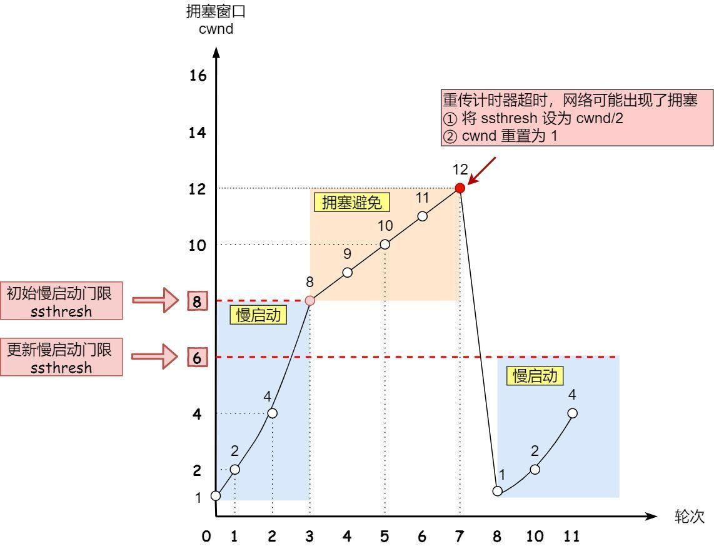

    2、快速重传（发送方收到 3 个相同的 ACK），使用的拥塞发生算法为：

    > - cwnd = cwnd / 2
    > - ssthresh = cwnd

    接下来就会进入快速恢复阶段。

  - 快速恢复

    > 快速恢复算法：cwnd = ssthresh + 3（因为收到 3 个 ACK），然后进入拥塞避免阶段。

    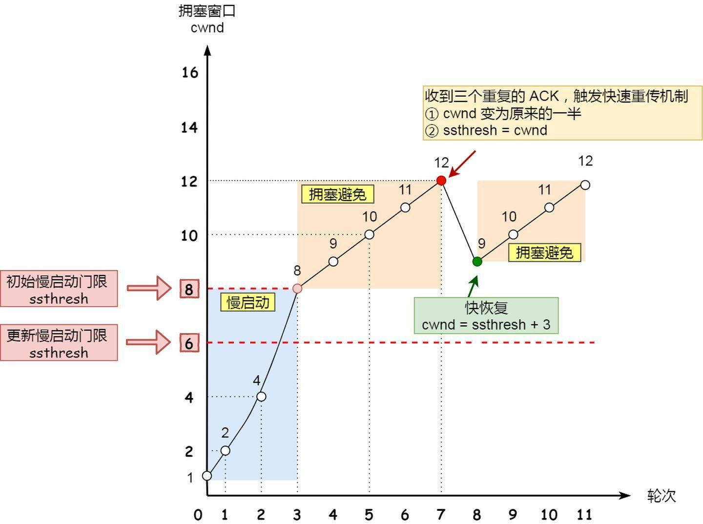

- 常见算法

  > New Reno：基于丢包检测
  >
  > CUBIC：基于丢包检测
  >
  > BBR：基于网络带宽

  和 TCP 不同的是，QUIC 是在用户空间实现的拥塞控制，可以非常灵活的设置，甚至可以为每一个请求都设置一种拥塞控制算法。


## 其他

**加密认证的报文**

TCP 协议头部没有经过任何加密和认证，所以在传输过程中很容易被中间网络设备篡改，注入和窃听。比如修改序列号、滑动窗口。这些行为有可能是出于性能优化，也有可能是主动攻击。

但是 QUIC 的 packet 可以说是武装到了牙齿。除了个别报文比如 PUBLIC_RESET 和 CHLO，所有报文头部都是经过认证的，报文 Body 都是经过加密的。

**全应用态协议栈**

QUIC 核心逻辑都在用户态，能灵活的修改连接参数、替换拥塞算法、更改传输行为。而 TCP 核心实现在内核态，改造需要修改内核并且进行系统重启，成本极高。

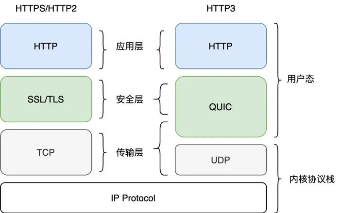

## QUIC协议的缺点

**增加了遭受攻击的脆弱性**

​	QUIC协议更容易受到分布式拒绝服务（DDoS）攻击的威胁。因为它是无连接的，不需要像TCP那样进行三次握手，攻击者更容易发起反射和放大攻击，通过伪造源IP地址来淹没目标服务器，使其不可用。QUIC的无连接性使其更难以进行流量控制和访问控制，从而增加了DDoS攻击的可能性。

**兼容性问题**

​	QUIC协议相对较新，可能与某些旧设备、网络设备或防火墙不兼容。一些应用程序需要精确控制网络行为，而QUIC的新特性可能不适用于所有用例。因此，在部署QUIC时，需要考虑与现有基础设施和设备的兼容性问题。

**传输速率较低**

​	尽管QUIC被设计为提供更快速和高效的数据传输，但它的传输速率可能受到加密和身份验证机制的影响。QUIC在数据包传输方面增加了额外的开销，这可能导致较小数据包的传输速率较低，尤其是在高延迟网络中。

**故障排除困难**

​	与TCP相比，使用QUIC进行网络故障排除可能更加复杂。由于QUIC的加密和身份验证功能，诊断与数据包丢失、网络拥塞或性能问题相关的问题可能需要更高级的网络监控工具和专业知识。解决问题的难度可能增加，因为数据包内容和流量可能不可见。


## 应用场景

**实时 Web 和移动应用程序**

实时通信应用程序，如视频通话、语音聊天和即时消息，需要低延迟和可靠的数据传输。QUIC通过独立的流和拥塞控制机制，提供了快速且高效的数据传输，适用于这些应用。

**物联网设备通信**

物联网设备通常在受限的网络环境中运行，使用TCP或MQTT等传输协议可能导致高延迟和数据包丢失。QUIC在高延迟和丢包的网络条件下表现出色，因此适用于与物联网设备的通信，提供可靠和高效的替代方案。

**车联网和联网汽车**

车联网生态系统需要实时的数据交换，以提供车辆跟踪、交通管理和安全功能。QUIC的低延迟、多路复用和数据包恢复能力有助于确保车辆和基础设施之间的可靠通信，并提高车联网系统的性能。

**云计算**

云计算涉及通过互联网交付计算资源。QUIC可以提供低延迟和端到端加密，从而改善云应用程序的用户体验和安全性。

**支付和电子商务应用程序**

支付和电子商务应用程序需要安全可靠的数据传输，以保护用户的敏感信息。QUIC通过使用TLS加密和可靠的HTTP3流，为这些应用程序提供了更高的安全性和性能，同时提高了用户体验。

# 基于QUIC的相关工作

具体实现上，各家会有比较大的差异。虽然从协议层面上来看，IETF QUIC 传输层的通用性设计，使得它可以适配各类业务场景，但在实践中，每个企业都有自己的侧重点。比如，谷歌会更多从浏览器角度出发，微软则更侧重于 Windows 等的适配，而像阿里手机淘宝这样的 App 厂商则需要更多考虑移动端适配和性能问题。

## 腾讯TQUIC网络传输协议

[提速 30%！腾讯TQUIC 网络传输协议-腾讯云开发者社区-腾讯云 2021-12-01](https://cloud.tencent.com/developer/article/1908451?policyId=1003)

腾讯核心业务用户登录耗时降低 30%，下载场景 500ms 内请求成功率从 HTTPS 的 60%提升到 90%，腾讯的移动端 APP 在弱网、跨网场景下取得媲美正常网络的用户体验。这是腾讯网关 sTGW 团队打造的 TQUIC 网络协议栈在实时通信、音视频、在线游戏、在线广告等多个腾讯业务落地取得的成果。TQUIC 基于下一代互联网传输协议 HTTP3/QUIC 深度优化，日均请求量级突破千亿次，在腾讯云 CLB、CDN 开放云客户使用。

> STGW团队：是腾讯内部负责开发和维护STGW(Seven-layer Traffic Gateway，七层流量网关)的核心团队

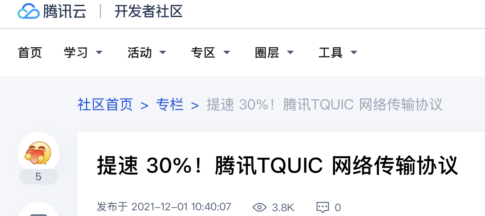

#### 

## 蚂蚁集团QUIC落地

[QUIC 协议在蚂蚁落地综述-腾讯云开发者社区-腾讯云2021-05-11](https://cloud.tencent.com/developer/article/1822608?policyId=1004) 

蚂蚁集团支付宝客户端团队与接入网关团队于 2018 年下半年开始在移动支付、海外加速等场景落地 QUIC。

### 一套落地框架

​	蚂蚁的接入网关是基于多进程的 NGINX 开发的 (内部称为 Spanner，协议卸载的扳手)，而 UDP 在多进程编程模型上存在诸多挑战，典型的像无损升级等。为了设计一套完备的框架，我们在落地前充分考虑了服务端在云上部署上的方便性、扩展性、以及性能问题，设计了如下的落地框架以支撑不同的落地场景：

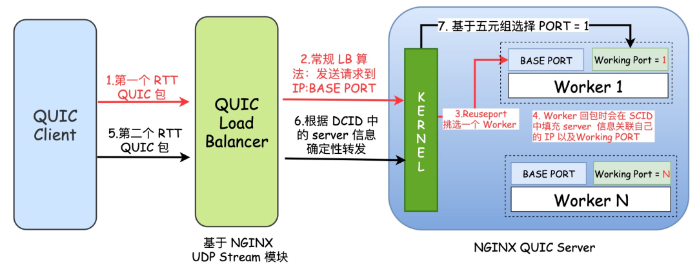

在这套框架中，包括如下两个组件：

1. QUIC LB 组件：基于 NGINX 4层 UDP Stream 模块开发，用来基于 QUIC DCID 中携带的服务端信息进行路由，以支持连接迁移。

2. NGINX QUIC 服务器：开发了 NGINX_QUIC_MODULE，每个 Worker 监听两种类型的端口： 

   （1）BASE PORT ，每个 Worker 使用的相同的端口号，以 Reuseport 的形式监听，并暴露给 QUIC LB，用以接收客户端过来的第一个 RTT 中的数据包，这类包的特点是 DCID 由客户端生成，没有路由信息。 

   （2）Working PORT，每个 Worker 使用的不同的端口号，是真正的工作端口，用以接收第一个 RTT 之后的 QUIC 包，这类包的特定是 DCID 由服务端的进程生成携带有服务端的信息。

当前框架支持的能力包括如下：

1. 在不用修改内核的情况下，完全在用户态支持 QUIC 的连接迁移，以及连接迁移时 CID 的 Update;
2. 在不用修改内核的情况下，完全在用户态支持 QUIC 的无损升级以及其他运维问题;
3. 支持真正意义上的 0RTT ，并可提升 0RTT 的比例;

### 关键技术

#### 技术点1：优雅的支持连接迁移能力

在端到端的落地过程中，因为引入了负载均衡设备，会导致在连接迁移时，所有依赖五元组 Hash 做转发或者关联 Session 的机制失效。以 LVS 为例，连接迁移后， LVS 依靠五元组寻址会导致寻址的服务器存在不一致。即便 LVS 寻址正确，当报文到达服务器时，内核根据五元组关联进程，依然会寻址出错。同时，IETF Draft 要求，连接迁移时 CID 需要更新掉，这就为仅依靠 CID 来转发的计划同样变的不可行。

为了解决此问题，其设计了开篇介绍的落地框架，这里将方案做一些简化和抽象，整体思路如下图所示：

1. 在四层负载均衡上，设计了 QUIC LoadBalancer 的机制：
   1. 在 QUIC 的 CID 中扩展了一些字段（ServerInfo）用来关联 QUIC Server 的 IP 和 Working Port 信息。
   2. 在发生连接迁移的时候，QUIC LoadBalancer 可以依赖 CID 中的 ServerInfo 进行路由，避免依赖五元组关联 Session 导致的问题。
   3. 在 CID 需要 Update 的时候，NewCID 中的 ServerInfo 保留不变，这样就避免在 CID 发生 Update 时，仅依赖 CID Hash 挑选后端导致的寻址不一致问题。
2. 在 QUIC 服务器多进程工作模式上，突破了 NGINX 固有的多 Worker 监听在相同端口上的桎梏，设计了多端口监听的机制，每个 Worker 在工作端口上进行隔离，并将端口的信息携带在对 First Initial Packet 的回包的 CID 中，这样代理的好处是：
   1. 无论是否连接迁移，QUIC LB 都可以根据 ServerInfo，将报文转发到正确的进程。
   2. 而业界普遍的方案是修改内核，将 Reuse port 机制改为 Reuse CID 机制，即内核根据 CID 挑选进程。即便后面可以通过 ebpf 等手段支持，但其认为这种修改内核的机制对底层过于依赖，不利于方案的大规模部署和运维，尤其在公有云上。
   3. 使用独立端口，也有利于多进程模式下，UDP 无损升级问题的解决，这个我们在技术点 3 中介绍。

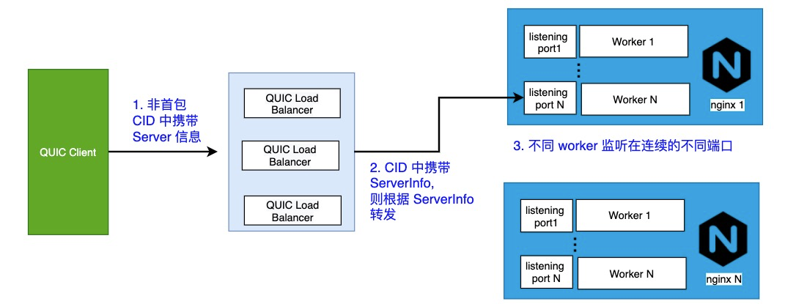

#### 技术点2： 提升0RTT握手比例

QUIC 同样需要对握手的源地址做校验，否则便会存在 UDP 本身的 DDOS 问题，那 QUIC 是如何实现的？依赖 STK(Source Address Token) 机制。这里我们先声明下，跟 TLS 类似，QUIC 的 0RTT 握手，是建立在已经同一个服务器建立过连接的基础上，所以如果是纯的第一次连接，仍然需要一个 RTT 来获取这个 STK。

理论上说，只要客户端缓存了这个 STK，下次握手的时候带过来，服务端便可以直接校验通过，即实现传输层的 0RTT。但是真实的场景却存在**如下两个问题**：

1. 因为 STK 是服务端加密的，所以如果下次这个客户端路由到别的服务器上了，则这个服务器也需要可以识别出来。
2. STK 中 encode 的是上一次客户端的地址，如果下一次客户端携带的地址发生了变化，则同样会导致校验失败。此现象在移动端发生的概率非常大，尤其是 IPV6 场景下，客户端的出口地址会经常发生变化。

第一个问题比较好解，我们只要保证集群内的机器生成 STK 的秘钥一致即可。**第二个问题，我们的解题思路是**：

1. 我们在 STK 中扩展了一个 Client ID, 这个 Clinet ID 是客户端通过无线保镖黑盒生成并全局唯一不变的，类似于一个设备的 SIMID，客户端通过加密的 Trasnport Parameter 传递给服务端，服务端在 STK 中包含这个 ID。

2. 如果因为 Client IP 发生变化导致校验 STK 校验失败，便会去校验 Client ID，因为 ID 对于一个 Client 是永远不变的，所以可以校验成功，当然前提是，这个客户端是真实的。为了防止 Client ID 的泄露等，我们会选择性对 Client ID 校验能力做限流保护。

   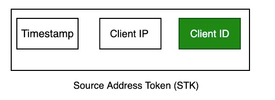

#### 技术点3：支持QUIC无损升级

设计了如下的 **基于多端口轮转的无损升级方案**，简单来说，我们让新老进程监听在不同的端口组并携带在 CID 中，这样 QUIC LB 就可以根据端口转发到新老进程。为了便于运维，我们采用端口轮转的方式，新老进程会在 reload N 次之后，重新开始之前选中的端口。

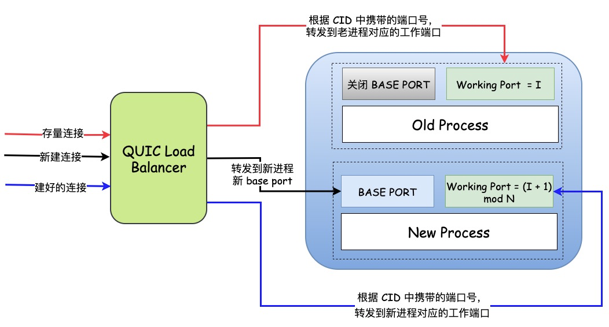

#### 技术点4：客户端智能选路

在客户端上，设计了开篇介绍的 TCP 和 QUIC 相互 Backup 的链路，如下图所示，我们实时探测 TCP 链路和 QUIC 链路的 RTT、丢包率、请求完成时间、错误率等指标情况，并根据一定的量化方法对两种链路进行打分，根据评分高低，决定选择走哪种链路，从而避免寻址只走一条链路导致的问题。

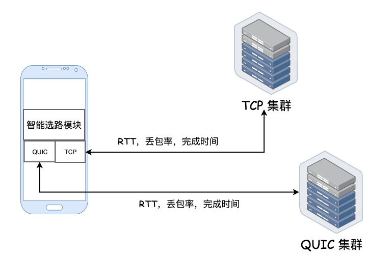


## 阿里自研XQUIC

2020-08-13 [阿里淘系自研标准化协议库XQUIC首次公开：直播高峰期卡顿可降低30%_架构_阿里巴巴淘系架构团队_InfoQ精选文章 2020-08-13](https://www.infoq.cn/article/SY0KFJ2pyJomB6sAkqls)

2022-01-07 [阿里正式开源自研 XQUIC：已服务手淘上亿用户，网络耗时降低超 20%_开源_褚杏娟_InfoQ精选文章 2022-01-07](https://www.infoq.cn/article/Ys2t7jLFRNFG9XDkeS27)

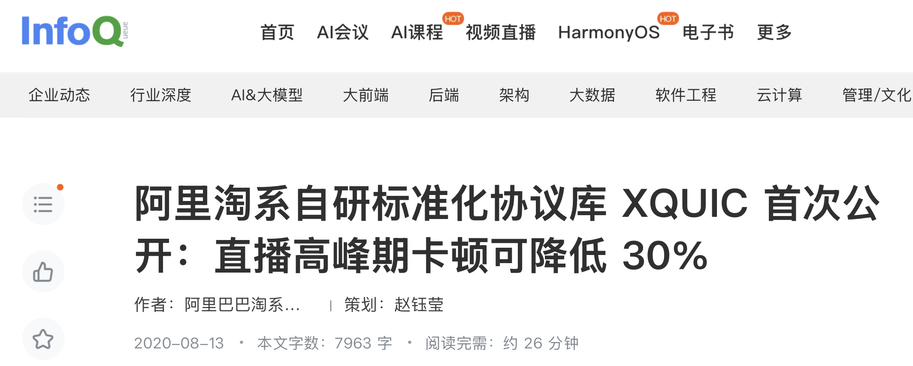

阿里大淘宝技术团队在2018年年底开始研发XQUIC的实现，2020年首次对外公开分享该技术，2021年8月正式对外发布，2022年正式开源。XQUIC 是阿里巴巴淘系架构团队自研的 IETF QUIC 标准化协议库实现，在手机淘宝上进行了广泛的应用，并在多个不同类型的业务场景下取得明显的效果提升。

XQUIC 协议的整体架构遵循 IETF QUIC 协议分层的设计理念，阿里团队针对传输层和应用层做了解耦实现。当前的 XQUIC 开源版本与之前发布的版本相比，新增了对 IETF RFC 版本的 QUIC v1 支持，对 QPACK 等部分功能模块进行了重构，增加了多路径支持等功能。到目前为止，XQUIC 已经在手淘正式版本为上亿用户提供了网络请求加速的体验优化。

XQUIC 本身服务手淘场景，目前更多地聚焦在短视频传输、视频/图片上传等典型的可靠传输场景，但 XQUIC 也将非可靠传输 / 半可靠传输场景纳入研发计划，未来也将结合社区开发者诉求，逐步纳入更多传输需求场景。

国内首个自研开源IETF QUIC协议栈XQUIC： 是一个适配移动端、轻量且高性能的传输协议库

XQUIC项目链接：https://github.com/alibaba/xquic

XQUIC主要具备以下两个优势：

- 协议设计方面：XQUIC 是按照 IETF QUIC 标准[1]进行的协议栈能力实现，在互通性方面，XQUIC 也在 IETF 开发者社区进行了比较充分的互通性验证[2]。在 QUIC V1 标准的基础之上，XQUIC 添加了**对多路径传输的能力支持**。
- 协议实现方面：XQUIC 是跨平台的 C 库实现，当前提供对Android/iOS/Linux 平台的支持。在移动端 APP 场景，XQUIC 在 Android / iOS 双端的包大小在 300～400KB 之间，相对轻量化。同时，XQUIC 也具备高性能传输能力，针对移动性场景优化也会持续进行。关于 multipath 技术演进，具体可以点击查看大淘宝技术团队与达摩院 XG 实验室联合发表的论文(https://dl.acm.org/doi/abs/10.1145/3452296.3472893)。

XQUIC 将手淘导购 RPC 的网络耗时缩减了 17.52%~20.26%，短视频/图片的上传速度提升了 22.61%，并减少了短视频下载场景下 7~16%的视频分片下载耗时。


## MQTT over QUIC：下一代物联网标准协议为消息传输场景注入新动力

[MQTT over QUIC：下一代物联网标准协议为消息传输场景注入新动力-腾讯云开发者社区-腾讯云 2022-07-29 ](https://cloud.tencent.com/developer/article/2061429?policyId=1004)

### QUIC在MQTT通信场景中的应用场景

物联网设备通常在受限的网络环境中运行，使用TCP或MQTT等传输协议可能导致高延迟和数据包丢失。QUIC在高延迟和丢包的网络条件下表现出色，因此适用于与物联网设备的通信，提供可靠和高效的替代方案。

MQTT 是基于 TCP 的[物联网通信](https://cloud.tencent.com/product/iothub?from_column=20065&from=20065)协议，紧凑的报文结构能够在严重受限的硬件设备和低带宽、高延迟的网络上实现稳定传输；心跳机制、遗嘱消息、QoS 质量等级等诸多特性能够应对各种物联网场景。

尽管如此，由于底层 TCP 传输协议限制，某些复杂网络环境下 MQTT 协议存在固有的弊端：

- 网络切换导致经常性连接中断
- 断网后重新建立连接困难：断网后操作系统释放资源较慢，且应用层无法及时感知断开状态，重连时 Server/Client 开销较大
- 弱网环境下数据传输受限于拥塞、丢包侦测和重传机制

例如车联网用户通常会面对类似的问题：车辆可能会运行在山区、矿场、隧道等地方，当进入到信号死角或被动切换基站时会导致连接中断，频繁连接中断与较慢的连接恢复速度会导致用户体验变差。在一些对数据传输实时性和稳定性要求较高的业务，如 L4 级别的无人驾驶中，客户需要花费大量的成本来缓解这一问题。

在上述这类场景中，QUIC 低连接开销和多路径支持的特性就显示出了其优势。经过更深入的探索，我们认为 MQTT Over QUIC 可以非常好地解决这一困境 —— 基于 QUIC 0 RTT/1 RTT 重连/新建能力，能够在弱网与不固定的网络通路中有效提升用户体验。

### EMQX 5.0 的 MQTT over QUIC 实现

EMQX 目前的实现将传输层换成 QUIC Stream，由客户端发起连接和创建 Stream，EMQX 和客户端在一个双向 Stream 上实现交互。

考虑到复杂的网络环境，如果客户端因某种原因未能通过 QUIC 握手，建议客户端自动退回到传统 TCP 上，避免系统无法建立跟服务器的通信。

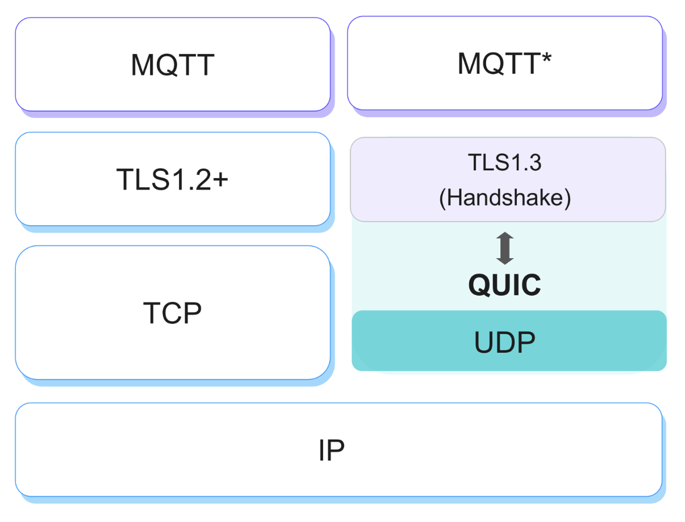

目前 EMQX 5.0 中已经实现了以下特性：

- **更高级的拥塞控制：**有效降低数据丢包率，在测试中在网络波动的情况下仍能持续稳定传输数据
- **运维友好：**减少大规模重连导致的开销（时间开销、客户端/服务器性能开销），减少不必要的应用层状态迁移而引发的系统过载（0 RTT）
- **更灵活的架构创新：**比如 Direct server return (DSR，服务器直接返回模式)，只有入口/请求流量经过 LB，出口和响应流量绕过 LB 直接回到客户端，减少 LB 的瓶颈
- **减少握手延迟 （1 RTT）**
- **多路径支持，连接平滑迁移：**从 4G 切换到 WIFI, 或者因为 NAT Rebinding 导致五元组发生变化，QUIC 依然可以在新的五元组上继续进行连接状态，尤其适用于网络经常性变化的移动设备
- **更敏捷的开发部署：**协议栈的实现在 userspace，能够开发快速迭代
- **端到端加密：**未加密的包头带有极少信息， 减少传输路径中中间节点的影响，带来更好的安全性和更可控的用户体验

### 更便捷的使用：NanoSDK 0.6.0

[NanoSDK](https://cloud.tencent.com/developer/tools/blog-entry?target=https%3A%2F%2Fgithub.com%2Fnanomq%2FNanoSDK%2F&objectId=2061429&objectType=1&isNewArticle=undefined) 0.6.0 基于 MsQuic 项目率先实现了第一个 C 语言的 MQTT over QUIC SDK。

NanoSDK 通过为 NNG 的传输层增加 QUIC 支持，使 MQTT、nanomsg 等协议能够从 TCP 转为 UDP，从而提供更好的物联网连接体验。其内部将 QUIC Stream 和 MQTT 连接映射绑定，并内置实现了 0 RTT 快速握手重连功能。


## AXP-QUIC：自适应X路QUIC网络传输加速

 [AXP-QUIC：自适应X路QUIC网络传输加速-腾讯云开发者社区-腾讯云 2022-12-10](https://cloud.tencent.com/developer/article/2190257?policyId=1004)

腾讯云[即时通信](https://cloud.tencent.com/product/im?from_column=20065&from=20065)IM实现了一种网络自适应的X路QUIC传输加速技术AXP-QUIC（Adaptive X-PATH QUIC），已应用于IM SDK客户端到服务端的数据传输。该技术建立了一套客户端弱网自评估模型，根据网络链路的RTT，丢包率，吞吐量，并结合主动探测，判断终端当前是否处于弱网络环境。同时将QUIC协议和多通道传输技术相结合，根据终端所处的网络环境，实时自动决定切换网络链路或使用多链路进行传输。**通过AXP-QUIC技术，即时通信IM能够在70%丢包的弱网络环境下，保证消息100%可靠传输，且不大幅度增加消息延时。**


## 微软 MsQUIC

https://github.com/microsoft/msquic 

MsQuic 是微软开源的一个 QUIC 协议的实现，采用 C 语言编写。核心是遵循一系列 RFC 标准，包括QUIC基础框架（RFC 9000-9002）、连接迁移（RFC 9221）以及最新的性能改进草案。该项目旨在提供一个跨平台的、通用的 QUIC 协议库，同时提供了 C++ API 的包装类，并支持与 Rust 和 C# 的互操作性。

- 根据项目文档的最新更新，以下是一些主要的更新内容：

  > **性能优化**：对客户端和服务器进行了优化，以提高吞吐量和降低延迟。
  > **异步 IO 支持**：提升数据处理效率。
  > **接收侧扩展（RSS）支持**：增加网络数据处理能力。
  > **UDP 发送和接收合并支持**：优化了 UDP 数据包的处理。
