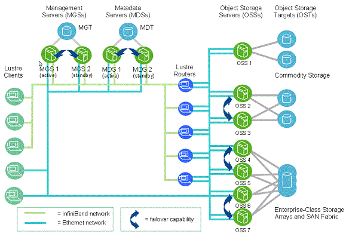
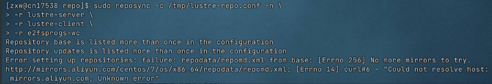

# 基础知识

​	[About the Lustre® File System | Lustre](https://www.lustre.org/about/)

​	Lustre文件系统是一种开源并行文件系统，支持一流 HPC 模拟环境的许多要求。Lustre 文件系统诞生于卡内基梅隆大学的一个研究项目，现已发展成为支持地球上一些最强大的超级计算机的文件系统。Lustre 文件系统提供符合 POSIX 标准的文件系统接口，可以扩展到数千个客户端、PB 级存储和每秒数百 GB 的 I/O 带宽。Lustre 文件系统的关键组件是元数据服务器 （MDS）、元数据目标 （MDT）、对象存储服务器 （OSS）、对象服务器目标 （OST） 和 Lustre 客户端。



[Lustre_Manual_cn.pdf](http://lustrefs.cn/wp-content/uploads/2023/03/Lustre_Manual_cn.pdf)

Lustre中的角色：

1. **管理服务器（Management Server, MGS）：**

​	● 管理整个文件系统的元信息和配置。

​	● 硬件要求：高性能 CPU、充足的内存和可靠存储设备。

2. **元数据服务器（Metadata Server, MDS）：**

​	● 存储文件系统的元数据（如文件名、目录结构等）。

​	● 通常与元数据目标（Metadata Target, MDT）一起部署在 MDS 上。

3. **对象存储服务器（Object Storage Server, OSS）：**

​	● 存储文件数据。

​	● 每个 OSS 管理一个或多个对象存储目标（Object Storage Target, OST）。

4. **客户端：**

​	● 连接并访问 Lustre 文件系统的计算节点

[环境要求-Lustre 2.13.0 部署指南（CentOS 8.0）-Lustre-开源使能-开发文档-鲲鹏社区](https://www.hikunpeng.com/document/detail/zh/kunpengsdss/ecosystemEnable/Lustre/openmind_kunpenglustre_04_0002.html))


#  安装部署

参考文档:

[Lustre 2.10安装.note](https://note.youdao.com/ynoteshare/index.html?id=113224210bf5120b2731ae9e0af5ebb4&type=note&_time=1734593758030)

[CentOS-7 安装Lustre-2.10.1文件系统_centos7安装lustre-CSDN博客](https://blog.csdn.net/spring_color/article/details/79301167?ops_request_misc=%7B%22request%5Fid%22%3A%22d9945c8131134fab2ed7eff447d79e82%22%2C%22scm%22%3A%2220140713.130102334.pc%5Fall.%22%7D&request_id=d9945c8131134fab2ed7eff447d79e82&biz_id=0&utm_medium=distribute.pc_search_result.none-task-blog-2~all~first_rank_ecpm_v1~rank_v31_ecpm-2-79301167-null-null.142^v100^pc_search_result_base3&utm_term=Lustre部署·centos7&spm=1018.2226.3001.4187)

| 节点名  | 节点IP       | 节点角色      | 软件版本            |
| ------- | ------------ | ------------- | ------------------- |
| cn17538 | 10.182.190.3 | MDS、MDT、OST | 系统版本：centos7.3 |
| cn17539 | 10.182.190.4 | MDT、OST      | 软件版本：7.2.4-el7 |
| cn17540 | 10.182.190.5 | Client        |                     |

### 简单配置Linux

1、更新yum源

```bash
$ yum clean all
$ yum makecache
$ yum update
```

2、 安装基础包

```bash
$ yum groupinstall "Development Tools" -y
$ yum install epel-release quilt libselinux-devel python-docutils xmlto asciidoc elfutils-libelf-devel elfutils-devel zlib-devel rng-tools binutils-devel python-devel sg3_utils newt-devel perl-ExtUtils-Embed audit-libs-devel lsof hmaccalc -y
```

3、关闭防火墙

```bash
$ systemctl stop firewalld.service
$ systemctl disable firewalld.service
```

###  构建本地Lustre repo库

```bash
$ vim /etc/yum.repos.d/lustre.repo
```

在lustre.repo里写入如下内容：

```bash
[lustre-server]
name=lustre-server
baseurl=https://downloads.whamcloud.com/public/lustre/latest-2.10-release/el7/server
# exclude=*debuginfo*
gpgcheck=0
enabled=1

[lustre-client]
name=lustre-client
baseurl=https://downloads.whamcloud.com/public/lustre/latest-2.10-release/el7/client
# exclude=*debuginfo*
gpgcheck=0
enabled=1

[e2fsprogs-wc]
name=e2fsprogs-wc
baseurl=https://downloads.whamcloud.com/public/e2fsprogs/latest/el7
# exclude=*debuginfo*
gpgcheck=0
enabled=1
```

更新源

```bash
$ yum clean all 
$ yum makecache
```

参考文档出现如下出现问题：



解决问题：参考文档中这一部分操作写了一堆，我也看不懂，不知道什么原因，我直接在/etc/yum.repos.d中创建了lustre.repo文件，并更新了yum源，似乎没什么问题


## 服务节点安装（MDS、OSS）

```bash
$ yum --nogpgcheck --disablerepo=* --enablerepo=e2fsprogs-wc install e2fsprogs -y
$ yum -y install epel-release
$ yum install http://download.zfsonlinux.org/epel/zfs-release.el7_3.noarch.rpm -y
$ yum upgrade linux-firmware dracut -y # 升级冲突包
$ yum upgrade xfsprogs kmod kexec-tools -y # 升级冲突包
$ yum install pciutils -y
$ yum --nogpgcheck --disablerepo=base,extras,updates --enablerepo=lustre-server install kernel kernel-devel kernel-headers kernel-tools kernel-tools-libs kernel-tools-libs-devel -y
$ reboot
$ yum --nogpgcheck --enablerepo=lustre-server install kmod-lustre-osd-ldiskfs lustre-dkms lustre-osd-ldiskfs-mount lustre lustre-resource-agents zfs lustre-osd-zfs-mount -y

加载 ZFS 文件系统的内核模块
$ modprobe -v zfs
加载 Lustre 文件系统的内核模块
$ modprobe -v lustre
```

服务节点安装的是2.10.8版本，客户端安装2.10.8版本时发现，centos默认的内核不支持客户端安装2.10.8版本，所以客户端安装的是2.10.1版本。


#  **客户端安装**

最好不要和MDS和ODS安装在一个节点上，会出现内核不兼容的问题，如果出现安装的客户端与默认的系统内核不兼容的问题，可以尝试更换系统中其他的内核

```bash
$ yum install kernel kernel-devel kernel-headers kernel-abi-whitelists kernel-tools kernel-tools-libs kernel-tools-libs-devel -y
$ reboot
$ yum install epel-release -y
$ yum --nogpgcheck --enablerepo=lustre-client install lustre-client-dkms lustre-client kmod-lustre-client -y
```

切换内核

```bash
查看当前系统可用内核
$ sudo awk -F\' '$1=="menuentry " {print i++ " : " $2}' /etc/grub2.cfg
选择输出的内核编号
$  sudo grub2-set-default '1'
$ reboot
```


# **配置**

​     Lustre是基于内核的分布式文件系统，而不是像其它一些用户态的分布式文件系统那样直接建立在ext3或者是ext4之上。Lustre需要对磁盘进行格式化，并且在格式化的过程中进行参数配置。

​    在 Lustre 中，MGS（Management Server） 是一个集中式的元数据服务，它负责管理整个 Lustre 文件系统的元数据。MGS 通常只在第一个 MDT 节点上配置，并且该节点会作为主 MDT 来管理所有的元数据操作。一旦配置了 MGS，Lustre 文件系统的所有 MDT节点会通过网络连接到该 MGS。因为 MGS 是唯一的，它的作用是服务所有 MDT 节点（无论你有多少个 MDT 节点）

### 配置MDT

通过--index来对每个MDT进行标识

```bash
1、配置第一个MDS
$ mkfs.lustre --reformat --fsname=lustrefs --mgs --mdt --index=0 /dev/nvme0n1p3
 $ mkdir /mnt/lustre/mdt
$ mount -t lustre /dev/nvme0n1p3 /mnt/lustre/mdt

2、配置第二个MDS
$ mkfs.lustre --reformat --fsname=lustrefs --mgsnode=10.182.190.3@tcp0 --mdt --index=1 /dev/nvme0n1p3
$ mkdir /mnt/lustre/mdt
$ mount -t lustre /dev/nvme0n1p3 /mnt/lustre/mdt
 
参数解释： 
fsname指定的是创建lustre时的文件系统名 
mgs指定该机器为元数据服务器，即该机器为mds 
mdt指定/dev/sdb为元数据实际数据存储位置 
至于index则指定该mgs的索引号，mgs可以设置主备模式，但mdt需要在主备mds之间共享 
```

### 配置OST

通过--index来对每个OST进行标识

```bash
1、配置第一个OST
$ mkfs.lustre --reformat --fsname=lustrefs --mgsnode=10.182.190.3@tcp0 --ost --index=0 /dev/nvme0n1p2
查看是否格式化成功
$ sudo lsblk -f
$ mkdir /mnt/lustre/ost
$ mount -t lustre /dev/nvme0n1p2 /mnt/lustre/ost

2、配置第二个OST
$ mkfs.lustre --reformat --fsname=lustrefs --mgsnode=10.182.190.3@tcp0 --ost --index=1 /dev/nvme0n1p2
查看是否格式化成功
$ sudo lsblk -f
$ mkdir /mnt/lustre/ost
$ mount -t lustre /dev/nvme0n1p2 /mnt/lustre/ost
```

### 配置Client

```bash
$ mkdir /mnt/lustre
$ mount -t lustre 10.182.190.3@tcp:/lustrefs /mnt/lustre
```

 